# AI Tools Config Sync — Design

**Date:** 2026-05-30
**Status:** Approved (pending spec review)
**Author:** Trung (with Claude)

## Goal

Bring the authored configuration for two AI coding tools — **Claude Code** (`~/.claude/`) and
**opencode** (`~/.config/opencode/`) — under version control in the dotfiles repo, deploy it by
symlink on macOS / Linux / Windows, and remove the one hardcoded `CONTEXT7_API_KEY` credential by
sourcing it from a gitignored environment file.

## Non-Goals

- Syncing Claude Code runtime **state** (sessions, projects, usage data, caches, plugins, `~/.claude.json`).
- Managing opencode's plugin install artifacts (`node_modules`, `package.json`, `bun.lock`).
- Building a generic multi-secret manager. We add exactly one secret now (`CONTEXT7_API_KEY`) but
  structure the secrets file so future keys drop in without rework.
- Testing the Windows deploy path from macOS (implemented now, verified on Windows later).

## Scope Decisions (locked)

| Decision | Choice |
|----------|--------|
| `~/.claude/` slice | **Authored config only** (no state, no `settings.local.json`) |
| Deploy method | **Symlink**, consistent with the rest of the repo |
| Secret store | **Gitignored local env file** sourced by zsh |
| Platforms | **All three** (macOS, Linux, Windows); Windows verified later |
| opencode config format | **`opencode.jsonc`** (JSONC, allows comments) |

## What is tracked vs. excluded

### Claude Code (`~/.claude/`)

**Tracked** (symlinked from repo `claude/`):

| Repo path | Target |
|-----------|--------|
| `claude/CLAUDE.md` | `~/.claude/CLAUDE.md` |
| `claude/settings.json` | `~/.claude/settings.json` |
| `claude/statusline.sh` | `~/.claude/statusline.sh` |
| `claude/statusline-command.sh` | `~/.claude/statusline-command.sh` |
| `claude/agents/` | `~/.claude/agents/` (whole-dir symlink) |
| `claude/commands/` | `~/.claude/commands/` (whole-dir symlink) |
| `claude/hooks/` | `~/.claude/hooks/` (whole-dir symlink) |
| `claude/skills/` | `~/.claude/skills/` (whole-dir symlink) |

**Excluded** (state / cache / secrets — never committed): `~/.claude.json`, `projects/`,
`plugins/`, `cache/`, `debug/`, `shell-snapshots/`, `usage-data/`, `file-history/`, `sessions/`,
`history.jsonl`, `statsig/`, `backups/`, `tasks/`, `plans/`, `ide/`, `*.bak`, `*.orig`,
`settings.local.json`, `mcp-needs-auth-cache.json`, `stats-cache.json`.

### opencode (`~/.config/opencode/`)

| Repo path | Target |
|-----------|--------|
| `.config/opencode/opencode.jsonc` | `~/.config/opencode/opencode.jsonc` |

**Excluded:** `node_modules`, `package.json`, `bun.lock` (opencode-managed). The current
`~/.config/opencode/opencode.json` is **renamed to `.jsonc`** and the stale `.json` is **deleted on
deploy** — opencode loads `.json` before `.jsonc` and *merges* all configs found, so leaving both
would let the stale file shadow the tracked one.

## Architecture

```mermaid
flowchart LR
    subgraph repo["dotfiles repo (git)"]
        OC[".config/opencode/opencode.jsonc<br/>reads {env:CONTEXT7_API_KEY}"]
        CC["claude/ — CLAUDE.md, settings.json,<br/>agents/ commands/ hooks/ skills/ statusline*"]
        EX["secrets.env.example<br/>(committed template)"]
    end
    subgraph machine["each machine"]
        SE["~/.config/dotfiles/secrets.env<br/>(gitignored, real key)"]
        ENV(["$CONTEXT7_API_KEY in shell env"])
        OCT["~/.config/opencode/opencode.jsonc"]
        CCT["~/.claude/* (symlinks)"]
        CJSON["~/.claude.json<br/>context7 header = $&#123;CONTEXT7_API_KEY&#125;"]
    end
    OC -. symlink .-> OCT
    CC -. symlink .-> CCT
    SE -->|sourced by zshrc| ENV
    ENV --> OCT
    ENV --> CJSON
    EX -. copy & fill .-> SE
```



## Credential Refactor

The real key lives **only** in an environment variable, never in git and never in `~/.claude.json`.

```mermaid
flowchart TD
    A["secrets.env (gitignored)<br/>export CONTEXT7_API_KEY=ctx7sk-..."] --> B["$CONTEXT7_API_KEY in shell"]
    B --> C["opencode.jsonc reads {env:CONTEXT7_API_KEY}<br/>(already correct — no change)"]
    B --> D["~/.claude.json context7 header<br/>= literal $&#123;CONTEXT7_API_KEY&#125; placeholder"]
    E["deploy step: claude mcp add --scope user<br/>--transport http context7 ...<br/>--header 'CONTEXT7_API_KEY: $&#123;CONTEXT7_API_KEY&#125;'"] --> D
    D -->|expanded at session time| F["context7 MCP authenticated"]
```



**Verified mechanics:**

- Claude Code expands `${VAR}` (and `${VAR:-default}`) in MCP `headers`/`url`/`env`, at session
  time. Source: https://code.claude.com/docs/en/mcp-servers.md#environment-variable-expansion-in-mcpjson
- User-scope MCP servers live only in `~/.claude.json` (not a syncable file), so the context7 server
  is (re)created by an **idempotent deploy step** rather than a tracked file.
- opencode supports `{env:VAR}` and already uses it — **no change** to the opencode side beyond the
  `.json` → `.jsonc` rename.

**Secrets file:**

- `~/.config/dotfiles/secrets.env` — gitignored, contains `export CONTEXT7_API_KEY="ctx7sk-..."`.
- `secrets.env.example` — committed template (keys, no values), documents required vars.
- `zsh/zshrc.sh` sources it when present:
  `[ -f "$HOME/.config/dotfiles/secrets.env" ] && source "$HOME/.config/dotfiles/secrets.env"`.
- Windows: `deploy_windows.ps1` reads the same gitignored `secrets.env` and sets `CONTEXT7_API_KEY`
  as a user env var via `[Environment]::SetEnvironmentVariable`.

**Key rotation:** the current `ctx7sk-...` value appeared in the brainstorming transcript. Rotate it
at context7.com after implementation; the new value goes into `secrets.env` only — nothing else changes.

## Cross-Platform SessionStart Hook

`unity-project-detect.sh` is already pure POSIX (`grep`, `awk`, `[ -f ]`, `$CLAUDE_PROJECT_DIR`) and
needs **no rewrite** — Git Bash provides all of it on Windows.

The only change is the command string in `settings.json`:

```diff
- /bin/bash /Users/trungnhm1998/.claude/hooks/unity-project-detect.sh
+ bash ~/.claude/hooks/unity-project-detect.sh
```

- `~` is expanded by the shell (POSIX `sh` and Git Bash both resolve it reliably — safer than `$HOME`,
  which the Node process may not see on Windows).
- `bash` (no `/bin/` prefix) resolves via PATH on all platforms.

**Execution model** (verified, https://code.claude.com/docs/en/hooks.md): macOS/Linux run hooks via
`sh`; Windows uses **Git Bash** when present (PowerShell only as fallback). Git Bash ships with Git
for Windows, already part of the Windows dotfiles setup.

**Dependency / fallback:** on a Windows machine without Git Bash, the SessionStart hook silently
no-ops; nothing else breaks. The hook also self-skips when cwd is not a Unity project.

## Deploy-Script Wiring

### `deploy.sh` / `setup_mac.sh` (macOS / Linux)

1. Symlink the `claude/` files and directories listed above into `~/.claude/` (back up any existing
   real file/dir first, per the repo's idempotency convention).
2. Symlink `.config/opencode/opencode.jsonc` → `~/.config/opencode/opencode.jsonc`; delete stale
   `~/.config/opencode/opencode.json` if it exists.
3. Ensure `~/.config/dotfiles/secrets.env` exists — copy from `secrets.env.example` if missing and
   warn the user to fill in real values.
4. Idempotent context7 MCP registration, guarded by `command -v claude`:
   ```bash
   claude mcp remove context7 --scope user 2>/dev/null || true
   claude mcp add --scope user --transport http context7 \
     https://mcp.context7.com/mcp \
     --header 'CONTEXT7_API_KEY: ${CONTEXT7_API_KEY}'
   ```
   Single quotes ensure the literal `${CONTEXT7_API_KEY}` placeholder lands in `~/.claude.json`,
   scrubbing the real key currently stored there.

### `zsh/zshrc.sh`

Add the secrets-source line (idempotent, guarded by file existence).

### `deploy_windows.ps1`

- Symlink the same files to `$HOME\.claude\…` and `$HOME\.config\opencode\opencode.jsonc`; delete
  stale `opencode.json`.
- Read the gitignored `secrets.env` and set `CONTEXT7_API_KEY` as a user env var.
- Run the same `claude mcp add` registration.
- Honors `-DryRun` / `-SkipPackages` like the rest of the script.

### `.gitignore` (repo root)

Add guards: `secrets.env`, `**/settings.local.json`, and the opencode-managed artifacts if not
already covered.

### Docs

Update the symlink-mapping tables in `CLAUDE.md` and `AGENTS.md` to include the new `claude/` and
`.config/opencode/` entries and the `secrets.env` convention.

## Testing / Validation

- `bash -n deploy.sh setup_mac.sh` — syntax check.
- `shellcheck` the modified scripts and the hook.
- Dry-run the macOS deploy; confirm symlinks resolve and `~/.config/opencode/opencode.json` is gone.
- `claude mcp list` shows `context7` at user scope; open a session and confirm context7 authenticates
  (i.e. `${CONTEXT7_API_KEY}` expanded from the env).
- Confirm `~/.claude.json` contains the `${CONTEXT7_API_KEY}` placeholder, not the literal key.
- Open a new zsh session; `echo $CONTEXT7_API_KEY` is populated from `secrets.env`.
- Windows: deferred manual verification (symlinks, env var, `claude mcp list`).

## Risks & Mitigations

| Risk | Mitigation |
|------|------------|
| Symlinked `settings.json` churns git on runtime toggles | Accepted tradeoff of symlink method; commit periodically |
| `~` not expanded → hook can't find script | Shell (sh / Git Bash) expands `~` reliably; hook no-ops if path missing |
| Windows lacks Git Bash | SessionStart hook silently no-ops; documented dependency |
| Stale `opencode.json` shadows `.jsonc` | Deploy explicitly deletes the `.json` |
| Real key accidentally committed | `.gitignore` guards `secrets.env`; placeholder-only in tracked files |
| Whole-dir symlinks capture machine-local files dropped into `agents/` etc. | Acceptable; authored dirs are intended to be fully shared |
