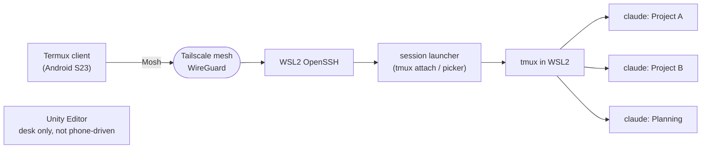

# Phone-Driven Claude Code Sessions (Walking Workflow)

- **Date:** 2026-06-14
- **Status:** Design approved (direction confirmed by user installing Tailscale on both ends)
- **Owner:** Max

## Problem & Goal

Work productively on projects via multiple Claude Code sessions from an Android phone
(Samsung S23 Ultra) while away from the desk — e.g. walking the dog — **without**:

- Claude Code's `/remote-control` (long `AskUserQuestion` prompts get truncated), and
- screen-mirroring tools (TeamViewer / Windows RDP).

**Goal:** a real-terminal, multi-session, reconnect-resilient workflow reachable from cellular.

### Why `/remote-control` failed

`/remote-control` re-bridges a terminal UI into a phone UI and mangles long prompts. The fix is
structural, not a patch: use a **real terminal** (Termux) attached to a **real multiplexer** (tmux).
Claude's `AskUserQuestion` prompts, tool-approval dialogs, and long output then render exactly as
they do on the desktop — the truncation problem disappears because nothing is being re-bridged.

## Scope

**In scope:** phone-driven Claude sessions that run **inside WSL2** — code, planning, refactors,
reviews, git. These reuse the tmux workflow already in the user's stack.

**Out of scope (deferred):**

- Driving Unity from the phone — the Editor, Unity MCP bridge, play mode, and builds stay native
  on the Windows desktop, used at the desk.
- TeamViewer / RDP / screen mirroring.
- Multi-user / sharing the tailnet with others.

## Architecture

**Path:** Termux (Android) → Mosh over Tailscale → WSL2 Ubuntu (sshd) → tmux → multiple Claude
sessions. **Tailscale runs inside WSL2**, so WSL is its own tailnet node — this sidesteps all
Windows↔WSL NAT and avoids `netsh portproxy` gymnastics. The Windows host's own OpenSSH (port 22)
is left untouched for occasional native-Windows access at the desk.

## Verified current state (2026-06-14)

Confirmed by read-only inspection of the WSL distro:

- WSL2 distro **Ubuntu-24.04** — default, running; default user `mint`; timezone Asia/Ho_Chi_Minh.
- **systemd is PID 1** (`/etc/wsl.conf` has `[boot] systemd=true`).
- Installed in WSL: `tmux`, `tailscale`, `tailscaled`, `ssh` (client), `sshd` (`/usr/sbin/sshd`).
- Tailscale in WSL is **installed but logged out** — needs `tailscale up` + browser auth.
- **`mosh` / `mosh-server` are NOT installed.**
- Phone: Tailscale app installed (per user).

Net: the foundation is ~70% present. Remaining gaps are authentication, `mosh`, sshd config, and
the phone client.

## Design — layers

### L1 — Connectivity: Tailscale (inside WSL)

- WSL is its own tailnet node with a stable MagicDNS name (referred to as `max-wsl` throughout this
  doc; set it explicitly via `sudo tailscale up --hostname=max-wsl`).
- Phone reaches it from anywhere, encrypted; no router config, no public SSH exposure.
- **State:** installed; **TODO:** `sudo tailscale up` in WSL (interactive auth), then confirm the
  phone and WSL see each other (`tailscale status`, ping by MagicDNS).
- Run `tailscaled` as a **systemd service** so the node persists and keeps the WSL VM alive.

### L2 — Entry & persistence: WSL2 sshd + lifecycle

- Enable/confirm `ssh` as a systemd service in WSL; **key-only auth, password auth disabled**;
  add the phone's public key to `~mint/.ssh/authorized_keys`. Pick a dedicated port (e.g. 22 inside
  the WSL node, since it is a separate tailnet IP from the Windows host).
- **WSL lifecycle:**
  - Sleep/resume: sessions survive Windows sleep.
  - The VM shuts down when no process runs; long-running `tailscaled`/`sshd` keep it alive.
  - After a **Windows reboot**, WSL does not auto-start until something launches it →
    **Task Scheduler entry at logon** runs `wsl.exe -d Ubuntu-24.04 ...` to boot it (and thus
    systemd services).
  - After a reboot, tmux is empty → a small **session-bootstrap script** recreates the standard
    per-project sessions; `claude --continue` resumes each conversation.

### L3 — Sessions: tmux

- **One named tmux session per project** (`proj-a`, `proj-b`, `planning`) — easy to switch on a phone.
- On login, land in a **session picker** (or auto-attach to a default), so connecting is one step.
- Reuse the existing `tmux/tmux.conf`, plus a small **mobile overlay**: larger status bar showing
  project + which session has a pending question, mouse mode on (tap to select / scroll), and a
  couple of large-target keybinds for session switching.
- Persistence: tmux survives every disconnect; Claude's `--continue` / `--resume` is the backstop
  if the VM ever restarts.

### L4 — Android client: Termux

- Install **Termux from F-Droid** (the Play Store build is abandoned); add `mosh` + `openssh`.
- Generate an SSH **key on the phone**; add its public key to the WSL node; password auth off.
- `~/.ssh/config` host alias so connecting is `mosh max-wsl`.
- **Termux:Widget** home-screen widget → one tap runs the connect script → mosh → tmux picker.

### L5 — Ergonomics ("set me up for all")

- **One-handed steer:** Termux **extra-keys row** (Esc, Ctrl, Tab, ↑ ↓ ← →, Enter, `/`) — this is
  what makes answering `AskUserQuestion` (arrow + Enter) and approving tool calls thumb-comfortable.
  tmux mouse mode adds tap-to-select.
- **Voice:** Gboard mic dictates into the Termux input line — dictate a prompt, hit Enter.
- **Bluetooth keyboard:** works natively in Termux, zero config — the bench-stop "real typing" mode.
- **Readability:** larger font + theme; status bar surfaces which session is waiting on input.

### Security

- Tailscale = nothing exposed publicly; default tailnet ACLs deny everyone else.
- SSH **keys only**, password auth disabled on the WSL sshd.
- Personal machine + personal indie projects; no secrets leave the box
  (`~/.config/dotfiles/secrets.env` stays put).

## Phases

### Phase 1 — End-to-end thread (single session)

1. `sudo tailscale up` in WSL; authenticate; note MagicDNS name. *(installed; auth pending)*
2. Verify phone ↔ WSL connectivity over the tailnet.
3. `sudo apt install mosh` in WSL.
4. Configure WSL sshd: key-only auth; add phone pubkey; enable as systemd service.
5. Phone Termux (F-Droid): install `mosh`+`openssh`, generate key, add `~/.ssh/config` alias.
6. From phone: `mosh max-wsl` → attach to one tmux session running `claude`. Confirm a long
   `AskUserQuestion` renders fully.

### Phase 2 — Multi-session + persistence

1. Per-project named tmux sessions + login session-picker.
2. `tailscaled` + `sshd` as systemd services (node persistence + VM keepalive).
3. Task Scheduler entry to auto-start WSL at Windows logon.
4. Session-bootstrap script + `claude --continue` recovery after reboot.

### Phase 3 — Ergonomics polish

1. Termux extra-keys config + mobile tmux overlay (status bar, mouse mode, switch keybinds).
2. Termux:Widget one-tap connect.
3. Voice-input flow notes; Bluetooth keyboard validation.

## Open items to verify on-machine (don't guess)

- **Mosh UDP over the tailnet:** confirm mosh's UDP port range (60000–61000) is reachable to the
  WSL tailnet IP. Fallback if fiddly: plain SSH-into-WSL over Tailscale + tmux still works fully.
- **WSL auto-start + keepalive** across Windows reboot (Task Scheduler) and the tmux session-recreate
  behavior after a cold start.
- **tailscaled persistence** as a systemd service so the WSL node stays registered.

## Deliverables into dotfiles

A `remote-phone/` area:

- WSL provisioning script (apt: `mosh`; sshd hardening; enable `tailscaled`/`ssh` services).
- `wsl.conf` / `.wslconfig` snippets (systemd already on).
- Task Scheduler auto-start entry (script + docs).
- tmux mobile overlay (additions layered on `tmux/tmux.conf`).
- Termux connect script + extra-keys config.
- A `docs/` runbook (one-time setup + daily "start a walk session" flow).
- Optionally wired into `deploy_windows.ps1`.
