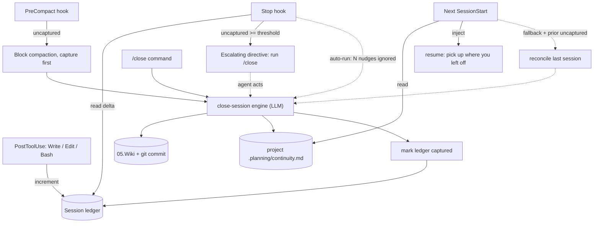

# Automated Close-Session Memory Protocol — Design

- **Date:** 2026-06-15
- **Status:** Approved design (pre-implementation)
- **Repo:** `dotfiles` (hooks/commands/skills symlinked into `~/.claude`)
- **Author:** Max + Claude (brainstorming session)

## Problem

Durable knowledge lives in the Obsidian vault's agent-owned `05.Wiki/`, but keeping it current is **manual** (`/wiki-capture`) and the only automation — a `Stop`-hook nudge (`claude/hooks/wiki-capture-nudge.sh`) — is a single, soft, once-per-session `systemMessage` that is trivially ignored. The result: Max repeatedly has to tell the agent to read and update the wiki. There is also no automated capture of **what changed / decisions made / decisions pending**, and no automated "pick up where I left off."

The read side already works: `SessionStart → vault-map.sh` injects the `05.Wiki/index.md` catalog; `UserPromptSubmit → vault-recall.sh` injects candidate notes on recall-shaped prompts. **This design fixes the write side and adds continuity read-back**, without breaking the working read side.

## Goals

1. Make durable-knowledge capture into `05.Wiki/` happen **reliably** without Max asking each time.
2. Track **changes, decisions made, and decisions pending** as first-class continuity state.
3. Automate "pick up where I left off" at session start.
4. Stay safe: never break a session; auto-writes auditable and revertible.
5. Be **toggleable** and phaseable.

## Non-goals

- Replacing `/wiki-capture` (kept for durable-only manual captures).
- Changing the wiki schema or the PARA/Inbox rules in the vault's `CLAUDE.md`.
- Cross-project continuity (continuity is per-project by nature).
- Guaranteeing capture the instant a terminal is killed mid-thought (covered by the next-session fallback, not by a real-time guarantee).

## Key decisions (with rationale)

| # | Decision | Rationale |
|---|---|---|
| 1 | **Hybrid** capture: in-session primary + fallback | Robust coverage; in-session is cheap/high-fidelity, fallback catches walk-aways. |
| 2 | **Two channels**: durable → `05.Wiki/`; continuity → per-project doc | Transient open-loops must not pollute the durable knowledge base (that's how wikis rot). |
| 3 | **Smart nudge + boundary-force** trigger | Fixes the ignored-nudge problem without trapping Max mid-work; forces only at genuine boundaries. |
| 4 | **Direct write + git audit** | Lowest friction; trusts the agent (it owns `05.Wiki/`); git is the safety net. |
| 5 | **`git init` the vault, no remote** | Local history only — commit / `git log` / revert; nothing to push. |
| 6 | Continuity doc at `<project>/.planning/continuity.md` | Transient per-project state belongs with the project, not the durable vault. |
| 7 | **`WIKI_FALLBACK=1` by default** | Max wants robustness on by default; still toggleable off. |

Platform constraint driving the architecture: **`SessionEnd` is unreliable** (does not fire on `/clear`; transcript can be missing — GH #6428, #3046). The reliable anchors are **`Stop`** (every turn), **`PreCompact`** (before context is summarised), and the next **`SessionStart`**. The design therefore depends on a persisted **ledger**, never on `SessionEnd` or transcript availability.

## Architecture

A deterministic per-session **ledger** is the spine. Shell hooks can't *judge* knowledge, but they can *count* — and counting is all the trigger logic needs to answer "was this session meaningful, and is that work captured?" An LLM engine (`/close`) does the actual distillation into the two channels.



### The ledger

Location: `~/.claude/.session-ledger/<session_id>.json` (same `$HOME/.claude/...` cross-platform pattern as today's `.wiki-nudge/` markers). Plus a per-project pointer `~/.claude/.session-ledger/by-project/<project-key>.json` (`project-key` = filesystem-safe slug of `cwd`) so the next `SessionStart` can find prior uncaptured work **without** depending on the (possibly pruned) prior ledger file. The pointer is self-contained — refreshed on every ledger write and on capture:

```json
{ "session_id": "abc123", "project": "dotfiles", "uncaptured": true,
  "summary": "7 files, 2 commits, 1 PR", "updated_at": "2026-06-15T11:40:00" }
```

```json
{
  "session_id": "abc123",
  "cwd": "C:/Users/mint/dotfiles",
  "project": "dotfiles",
  "turns": 14,
  "signals":            { "files_written": 7, "files_edited": 3, "git_commits": 2, "prs_opened": 1 },
  "signals_at_capture": { "files_written": 0, "files_edited": 0, "git_commits": 0, "prs_opened": 0 },
  "nudge_level": 0,
  "precompact_blocked": false,
  "last_capture_at": null
}
```

- **Uncaptured delta** = `signals − signals_at_capture`.
- **Meaningful** = delta ≥ threshold: `(files_written + files_edited) ≥ WIKI_THRESHOLD_FILES` OR `git_commits ≥ WIKI_THRESHOLD_COMMITS` OR `prs_opened ≥ 1`. Below threshold → silent.
- Old ledgers pruned with `find -mtime +7 -delete` (existing housekeeping pattern).

## Components

All hooks: read stdin JSON, fail open (`exit 0` and stay silent on any error — missing vault, missing `jq`, corrupt ledger). They must never break a session.

> **Implementation note (verify, don't guess):** the exact block mechanics for `Stop` and `PreCompact` — JSON `{"decision":"block","reason":…}` vs `exit 2`, and the precise `hookSpecificOutput` field names — must be confirmed against the current Claude Code hooks docs before relying on them. The values below reflect the research in this session but are version-sensitive.

### `session-ledger.sh` — `PostToolUse` matcher `Write|Edit|Bash` (new)
Increments `signals` in the ledger. For `Bash`, inspects `tool_input.command` for `git commit` / `gh pr create` (cheap regex) and bumps `git_commits` / `prs_opened`. Also refreshes the per-project pointer. Silent (`exit 0`, no stdout). Short timeout (e.g. 5s).

### `session-capture-stop.sh` — `Stop` (replaces `wiki-capture-nudge.sh`)
1. Bump `turns`. If `WIKI_AUTO=0` or delta < threshold → `exit 0` silent.
2. Else increment `nudge_level` and emit an **escalating, specific** directive via `hookSpecificOutput.additionalContext`, e.g. *"You've edited 6 files and committed twice since the last capture. Run `/close` to file durable knowledge into 05.Wiki and update the continuity doc."* Tone sharpens with `nudge_level`.
3. If `WIKI_AUTORUN=1` AND `nudge_level ≥ WIKI_AUTORUN_AFTER` (default 3) AND not already forced this epoch → emit `{"decision":"block","reason":"<run /close now>"}` to force the agent to continue and capture; set a marker so it does not re-trap until new uncaptured work accrues.

> Honest scope: the non-blocking nudge is *louder and persistent*, not a hard guarantee. The guarantees come from `PreCompact`, `/close`, the optional auto-run block, and the fallback.

### `precompact-capture.sh` — `PreCompact` matcher `manual`+`auto` (new)
If `WIKI_AUTO=1` and delta ≥ threshold and `precompact_blocked == false`: set `precompact_blocked = true` and **block compaction** with a reason instructing capture-before-squash (this is the real "knowledge about to be lost" moment). If `precompact_blocked == true` already (agent didn't capture) → `exit 0`, let compaction proceed; the fallback catches it next session. Prevents infinite block loops.

### `continuity-readback.sh` — `SessionStart` (new; sits beside `vault-map.sh`)
1. If `<cwd>/.planning/continuity.md` exists → inject it as `additionalContext` ("resume context — decisions made/pending, next steps").
2. Fallback (default on, `WIKI_FALLBACK=1`): read the per-project pointer. If it points to a **different** prior session that is still uncaptured ≥ threshold → inject a reconcile directive: *"Your last session in this project left uncaptured work (N files, M commits). Read `.planning/continuity.md` and run `/close` to reconcile before new work."*

### `close-session` skill + `/close` command (new)
The single capture engine invoked by `/close`, by the auto-run block, by `PreCompact`'s reason, and by the fallback. Flow:
1. Read `05.Wiki/CLAUDE.md` + `05.Wiki/index.md` + the project's `.planning/continuity.md` + the ledger summary.
2. **Durable channel** → distil reusable knowledge, update/create wiki pages (reusing `/wiki-capture` logic: frontmatter, dense `[[links]]`, `## Sources`, contradiction callouts), refresh `index.md`, append `log.md` tagged `auto` vs `manual`.
3. **Git audit** → in the vault repo, `git add` **only the explicit paths it wrote** (changed `05.Wiki/**`, `index.md`, `log.md` — never `git add -A`, so Max's unrelated manual edits are untouched) and commit: `wiki(auto): <YYYY-MM-DD> <summary>`.
4. **Continuity channel** → rewrite `<project>/.planning/continuity.md`: *Changes this session*, *Decisions MADE* (link wiki page if promoted), *Decisions PENDING / open*, *Next steps*.
5. **Mark captured** → snapshot `signals → signals_at_capture`, reset `nudge_level` / `precompact_blocked`, set `last_capture_at`.
6. Report created-vs-updated pages with one-line whys; list unresolved `[[links]]` as future-page TODOs.

`/wiki-capture` is unchanged (durable-only manual path).

### Continuity doc template (`.planning/continuity.md`)
```markdown
# Continuity — <project>
_Updated: <YYYY-MM-DD HH:MM> · session <id>_

## Changes this session
- <what changed: files, features, fixes>

## Decisions made
- <decision> — <rationale> [[wiki-page]]

## Decisions pending / open
- <open question or deferred choice>

## Next steps
- <concrete next action>
```

## Configuration (env vars; per-machine in shell rc, or per-project)

| Var | Default | Effect |
|---|---|---|
| `WIKI_AUTO` | `1` | Master kill-switch for the whole protocol. |
| `WIKI_AUTORUN` | `0` | In-session: escalate to a forced `Stop` block after ignored nudges. |
| `WIKI_AUTORUN_AFTER` | `3` | Nudges to ignore before auto-run blocks (if enabled). |
| `WIKI_FALLBACK` | `1` | Next-SessionStart reconciliation of walk-away sessions. |
| `WIKI_FALLBACK_HEADLESS` | `0` | Experimental background `claude -p` capture (Phase 3). |
| `WIKI_THRESHOLD_FILES` | `3` | Files-touched delta that counts as meaningful. |
| `WIKI_THRESHOLD_COMMITS` | `1` | Commits delta that counts as meaningful. |

## `git init` the vault (one-time setup)

Add to the deploy path (or a `scripts/init-vault-git.sh`): `git init` at the vault root (no remote), a `.gitignore` for `.obsidian/workspace*` and OS cruft (keep notes + attachments tracked), and an initial commit. The protocol thereafter commits **only its own paths** under `05.Wiki/`. Degradation: if Max declines git, the engine instead writes a `log.md` audit line plus a `.bak` of each changed page.

## Safety & error handling

- **Fail open everywhere** — any hook error → `exit 0`, silent. A broken hook never blocks work.
- **No vault on this machine** → all vault hooks no-op (`resolve_obsidian_vault || exit 0`, per `lib/obsidian-vault.sh`).
- **`/clear` resilience** — logic depends on the persisted ledger, not `SessionEnd`/transcript, so `/clear` loses nothing; the fallback reconciles next session.
- **PreCompact loop guard** — block at most once per uncaptured epoch.
- **Explicit-paths-only commits** — never sweep Max's manual vault edits into an auto-commit.
- **Threshold gate** — trivial sessions stay completely silent.

## Phasing

- **Phase 1 (MVP):** ledger (`session-ledger.sh`) + escalating Stop nudge (`session-capture-stop.sh`) + `/close` + `close-session` skill + continuity doc + `continuity-readback.sh` read-back + `git init` vault. Fixes ~80% of the pain.
- **Phase 2:** `precompact-capture.sh` force + next-SessionStart fallback reconcile + auto-run block (`WIKI_AUTORUN`).
- **Phase 3 (experimental):** `WIKI_FALLBACK_HEADLESS` background `claude -p` capture (nested-headless is unproven on Claude Code; off by default, clearly labelled).

## Testing

- `bash -n` + `shellcheck` on every hook.
- Harness piping synthetic hook JSON (`echo '{…}' | bash hook.sh`) asserting output JSON + exit codes for: ledger increments (Write/Edit/Bash incl. git-commit sniff), threshold gating (below/above), Stop escalation levels, auto-run block guard, PreCompact block-once guard, fallback detection from the per-project pointer.
- `/close` dry-run (no writes) on a scratch vault.
- Live end-to-end on this `dotfiles` repo — meta-test by capturing *this* design session.

## Files touched

**New:** `claude/hooks/session-ledger.sh`, `claude/hooks/session-capture-stop.sh`, `claude/hooks/precompact-capture.sh`, `claude/hooks/continuity-readback.sh`, `claude/commands/close.md`, `claude/skills/close-session/SKILL.md`, `scripts/init-vault-git.sh`.
**Modified:** `claude/settings.json` (register `PostToolUse:Write|Edit|Bash`, `PreCompact`, extra `SessionStart`; repoint `Stop`), `CLAUDE.md`/`AGENTS.md` (document the protocol + toggles).
**Removed:** `claude/hooks/wiki-capture-nudge.sh` (superseded).

## Open questions / future

- Whether the continuity doc should ever be promoted into a durable wiki page automatically (currently manual, via `/close` linking).
- Phase 3 headless: verify nested `claude -p` auth/cost/async behavior before enabling.
