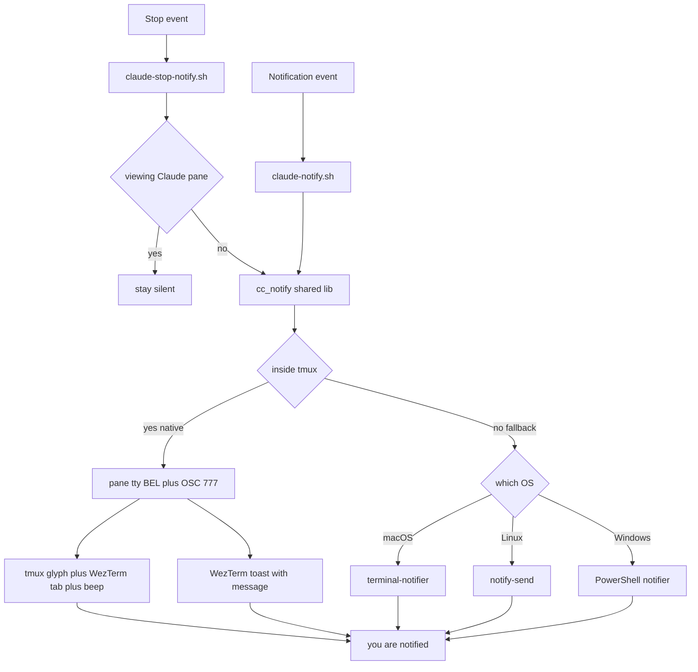

# Claude Code notifications on macOS: native tmux + WezTerm path

**Date:** 2026-06-23
**Status:** Implemented & verified live
**Scope:** macOS (tmux-centric). Windows path untouched.

## Problem

Claude Code never surfaced any notification on macOS, where Claude runs inside
**tmux** under **WezTerm**. The user assumed it was a `wezterm.lua` problem.

## Root cause (multi-layer)

The chain is `Claude Code → tmux → WezTerm → macOS Notification Center`, broken at more
than one boundary:

1. **WezTerm is not in Claude Code's desktop-notification allow-list.** Per the official
   docs, Claude sends desktop notifications *only* for Ghostty, Kitty, and iTerm2 — so
   `preferredNotifChannel: "auto"` emits **nothing** on WezTerm, even without tmux.
   (https://code.claude.com/docs/en/terminal-config)
2. **tmux swallows OSC notification sequences** unless `allow-passthrough on` is set.
3. **The existing `Notification` hook used `osascript display notification`**, which macOS
   **silently drops** (exit 0, no toast) when the responsible terminal app lacks
   Notification Center permission — and under tmux the notification is attributed to the
   tmux-server's responsible process, which has no permission entry and never appears in
   System Settings to grant.

## Two events, one delivery

Two Claude Code events now drive notifications, both funnelled through one delivery
function so behaviour and the escape-sequence math live in exactly one place:

- **`Notification`** (Claude needs permission / is waiting for input) → `claude-notify.sh`
  → always notifies.
- **`Stop`** (Claude finished a turn) → `claude-stop-notify.sh` → notifies **only when you
  are not looking at Claude's pane** (a focus gate; otherwise every response would toast).

Both call `cc_notify "<title>" "<body>"` in `lib/notify-lib.sh`.

## Architecture



## Components

| File | Role |
|------|------|
| `claude/hooks/lib/notify-lib.sh` | `cc_notify(title, body)` — single delivery function. Inside tmux: raw BEL (cues) + tmux-wrapped OSC 777 (WezTerm toast). Else: `terminal-notifier` / `notify-send` / PowerShell. |
| `claude/hooks/claude-notify.sh` | `Notification` hook — extracts `.message`, always `cc_notify`. |
| `claude/hooks/claude-stop-notify.sh` | `Stop` hook — focus-gated `cc_notify "finished — back to you"`. |
| `tmux/tmux.conf` | `allow-passthrough on` (OSC reaches WezTerm) + `extended-keys` (Shift+Enter newline in Claude). |
| `setup_mac.sh` | `terminal-notifier` added to the brew list. |
| `claude/settings.json` | `Stop` array wired to both `session-capture-stop.sh` and `claude-stop-notify.sh`. |
| `.config/wezterm/wezterm.lua` | **Unchanged.** `notification_handling = "AlwaysShow"` already set. Deliberately **no** `wezterm.on('bell')` handler — it would double the toast. |

## Native escape sequences (the key detail)

```sh
printf '\a'                                                              # cues
printf '\033Ptmux;\033\033]777;notify;%s;%s\007\033\\' "$title" "$body"  # toast
```

The OSC's inner `ESC` is **doubled** (`\033\033`) inside the tmux passthrough DCS wrapper
`\033Ptmux; … \033\\`. Title and body are sanitised (`;`/newlines flattened, control
chars stripped) because OSC 777 is `;`-delimited. The write is wrapped
`{ { … } > "$tty"; } 2>/dev/null` so a failed tty open never leaks an error from a hook.

## Stop-event focus rule

- **Suppress** when `lsappinfo` says WezTerm is frontmost **and** Claude's tmux pane is the
  active pane (`#{&&:#{window_active},#{pane_active}}` == 1) → you're watching.
- **Notify** otherwise (tabbed to a browser, Unity, another pane/window).
- **Fails safe:** if focus can't be determined, notify (better a spare toast than a miss).
- **Limitation:** WezTerm frontmost on a *different* (non-tmux) tab is treated as "watching"
  and suppressed. Acceptable for v1.
- **Audible bell kept ON** per user preference (the BEL still beeps; cues stay visual+audio).

## One-time macOS permission

Both notifiers post to Notification Center, so each needs permission (granted once):
**WezTerm** (native OSC toast) and **terminal-notifier** (fallback).

## Verification (2026-06-23, live)

- Cues (raw BEL): tmux glyph + WezTerm tab mark + beep — confirmed.
- Toast (OSC 777 via passthrough): WezTerm banner with message text — confirmed.
- Notification hook end-to-end (after the lib refactor): exit 0 + toast — confirmed.
- Stop hook: frontmost = WezTerm + active pane → correctly **suppressed**; notify path
  delivers via `cc_notify` — confirmed.
- Fallback (`TMUX` unset → `terminal-notifier`): exit 0, no stderr leak — confirmed.

## Caveats / cross-machine

- **Linux without a notification daemon:** OSC 9/777 can briefly hang WezTerm (~10–15 s).
  macOS unaffected.
- **Inside tmux but outer terminal ≠ WezTerm** (e.g. phone over SSH): cues still work; the
  desktop toast won't (the OSC is ignored). Acceptable.
- **Windows:** no tmux, so hooks fall through to the existing PowerShell notifier — untouched.

## Out of scope / future

- Per-WezTerm-tab focus accuracy for the Stop gate (currently approximated).
- Windows-native OSC 777 (currently uses the PowerShell notifier with WezTerm pane id).
- A "long task only" heuristic for the Stop toast (e.g. suppress turns under N seconds).
