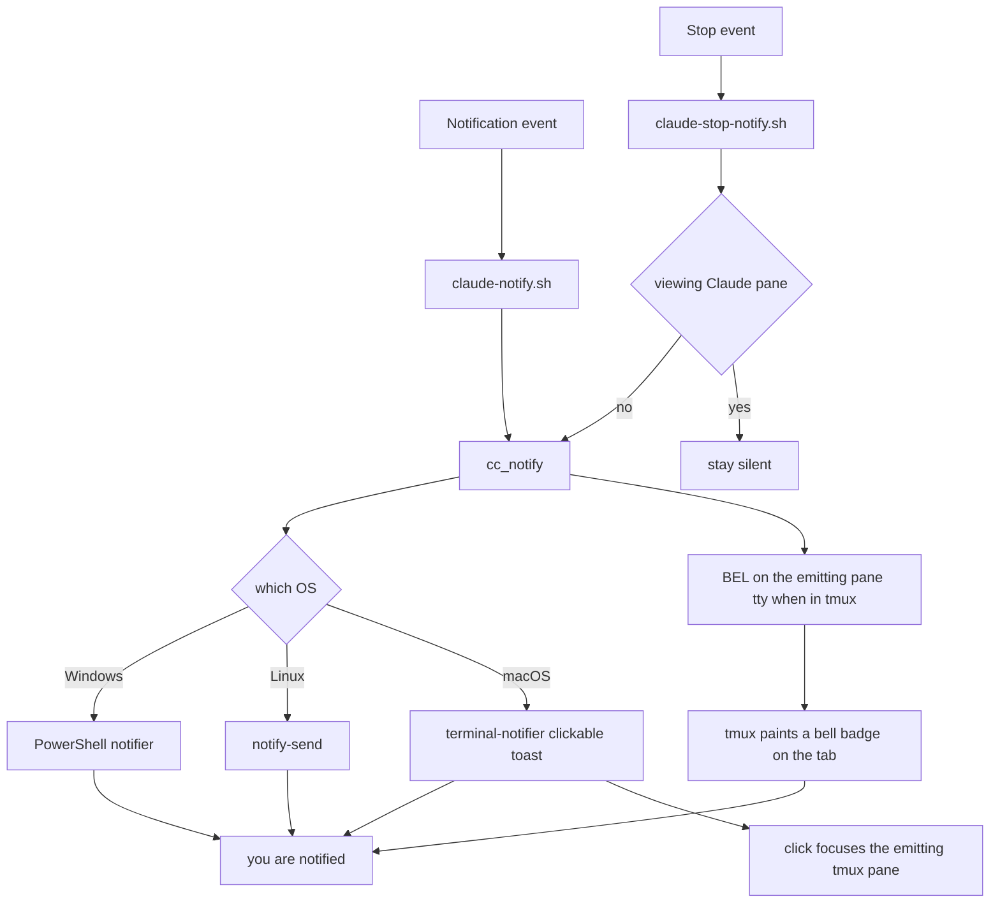

# Claude Code notifications on macOS: tmux bell badge + clickable terminal-notifier

**Date:** 2026-06-23
**Status:** Implemented & verified live (bell badge, terminal-notifier toast, click-to-focus, WezTerm thumbnail)
**Scope:** macOS (tmux-centric). Windows/Linux paths degrade gracefully.

## Problem

Claude Code runs inside **tmux** under **WezTerm**. Three things were wrong:

1. **No visible bell / no idea which tab rang.** A BEL fired but nothing showed in the
   status bar, so you couldn't tell *which* tmux tab was waiting on you.
2. **The toast wasn't visible on first show** — it only appeared later in Notification
   Center, never as an on-screen banner.
3. **No way to act on it** — clicking the toast should jump you to the tmux tab that fired.

## Root cause (multi-layer)

The chain is `Claude Code → tmux → WezTerm → macOS Notification Center`, broken at several
boundaries:

1. **WezTerm is not in Claude Code's desktop-notification allow-list.** Claude sends desktop
   notifications *only* for Ghostty, Kitty, and iTerm2 — so `preferredNotifChannel: "auto"`
   emits **nothing** on WezTerm, even without tmux.
   (https://code.claude.com/docs/en/terminal-config) → the hook is the only viable path.
2. **tmux swallows OSC sequences** unless `allow-passthrough on`.
3. **`osascript display notification` is silently dropped** under tmux (attributed to the
   tmux-server's responsible process, which has no permission entry to grant).
4. **(Problem #2) macOS files a banner straight to Notification Center with NO on-screen pop
   when it is attributed to the *frontmost* app.** The previous design rendered the toast via
   **WezTerm's OSC 777**, so the toast was attributed to WezTerm — and WezTerm is normally the
   frontmost app — so it was suppressed to history with no banner. (Confirmed live: the same
   message sent via `terminal-notifier` under its own identity *did* pop a banner while WezTerm
   was frontmost.)
5. **(Problem #1) the tmux bell was tracked but never drawn.** `monitor-bell on` +
   `bell-action any` correctly set `window_bell_flag`, but the **Catppuccin theme hardcodes a
   per-segment `#[bg=…]`** in `window-status-format`, which paints over the
   `window-status-bell-style` tint, **and** the Catppuccin bell glyph (`@catppuccin_window_flags_icon_bell`)
   was not present in the user's customised `@catppuccin_window_text`. Net: tmux knew which
   window rang, but nothing rendered.

## Two events, one delivery

- **`Notification`** (Claude needs permission / input) → `claude-notify.sh` → always notifies.
- **`Stop`** (Claude finished a turn) → `claude-stop-notify.sh` → notifies **only when you are
  not looking at Claude's pane** (focus gate).

Both call `cc_notify "<title>" "<body>"` in `lib/notify-lib.sh`.

## Decision

Drop the WezTerm OSC 777 toast on macOS. `cc_notify` now does **two** things at once:

- **In-terminal cue (inside tmux):** a raw **BEL** on the emitting pane's tty → tmux sets
  `window_bell_flag`, which now renders as a **peach 󰂞 badge** on that tab (so you see *which*
  tab is waiting), plus WezTerm's tab mark + audible bell.
- **Desktop toast:** the per-OS native notifier — on macOS **`terminal-notifier` under its own
  identity** (so it isn't frontmost-suppressed), with a **click action that focuses the exact
  emitting tmux window/pane** and raises WezTerm. Linux → `notify-send`; Windows → PowerShell.

**Why not OSC 777 anymore:** it's attributed to WezTerm (→ frontmost-app suppression, Problem #2)
and it can't carry a click action (Problem #3). `terminal-notifier` self-registers a permission
entry, always pops, and is clickable.

**Why no `-sender com.github.wez.wezterm`:** that re-attributes the banner to WezTerm and
re-introduces the frontmost-app suppression we just escaped. So the corner icon stays
terminal-notifier's. For branding the toast carries a **WezTerm thumbnail via `-contentImage`**
(a cached PNG generated once from WezTerm's `.icns`) — that changes only the displayed image, not
the attribution, so the banner stays reliable. On macOS Sequoia, `-appIcon` (which would override
the *corner* icon) is **silently ignored**, so `-contentImage` is the only branding that works.

## Architecture



## Components

| File | Role |
|------|------|
| `claude/hooks/lib/notify-lib.sh` | `cc_notify(title, body)` — single delivery fn. Inside tmux: BEL on the emitting pane's tty (lights the bell badge). Then per-OS toast: macOS `terminal-notifier` (own identity, `-execute` focuses the emitting pane, `-contentImage` WezTerm thumbnail via `_cc_wezterm_icon`), Linux `notify-send`, Windows PowerShell. |
| `claude/hooks/claude-notify.sh` | `Notification` hook — extracts `.message`, always `cc_notify`. |
| `claude/hooks/claude-stop-notify.sh` | `Stop` hook — focus-gated `cc_notify "finished — back to you"`. |
| `tmux/tmux.conf` | `allow-passthrough on`; `monitor-bell on` + `bell-action any`; `@catppuccin_window_text` prepends a peach 󰂞 badge when `window_bell_flag` is set. |
| `setup_mac.sh` | `terminal-notifier` in the brew list; pre-warms the `-contentImage` icon cache. |
| `claude/settings.json` | `Stop` array wired to `session-capture-stop.sh` + `claude-stop-notify.sh`; `Notification` → `claude-notify.sh`. |
| `.config/wezterm/wezterm.lua` | **Unchanged.** No `wezterm.on('bell')` handler (would double the toast). |

## Click-to-focus (the key detail)

`cc_notify` resolves the emitting pane from `$TMUX_PANE` and bakes a focus command into
`terminal-notifier -execute`:

```sh
tmux switch-client -t '<session>' ; \
tmux select-window -t '<pane_id>' ; \
tmux select-pane  -t '<pane_id>' ; \
/usr/bin/open -b com.github.wez.wezterm
```

- The absolute `tmux` path is baked in (the click runs in a minimal `sh -c`, and the
  interactive shell shadows `tmux` with a plugin function).
- Targeting the **pane id** (`%NN`) makes window/pane selection work across sessions.
- `switch-client` (no `-c`) acts on the most-recent client — the one you're on.
- Outside tmux there's no pane to focus, so the click uses `-activate com.github.wez.wezterm`.

## tmux bell badge (the key detail)

```tmux
set -g @catppuccin_window_text "#{?window_bell_flag,#[fg=#232634#,bg=#e5c890] 󰂞 #[fg=#c6d0f5#,bg=#{@thm_surface_0}],}#{?#{e|>=:#{client_width},#{@ui_full_min_width}}, #W,}"
```

- The badge lives **inside the window format** because Catppuccin's hardcoded `#[bg=…]` would
  override `window-status-bell-style`.
- Commas inside `#[…]` are **escaped `#,`** so they aren't parsed as the `#{?…}` ternary's
  true/false separator (the same gotcha as the width-adaptive status-right).
- It sits **outside** the width gate, so the badge shows even on a narrow client (phone over
  SSH); the flag auto-clears when you visit the window.

## Stop-event focus rule

- **Suppress** when `lsappinfo` says WezTerm is frontmost **and** Claude's tmux pane is active
  (`#{&&:#{window_active},#{pane_active}}` == 1) → you're watching.
- **Notify** otherwise; **fails safe** to notify if focus can't be determined.
- **Note:** with `terminal-notifier` (own identity) the toast is no longer frontmost-suppressed,
  so this explicit gate is what prevents a toast after every response. The `Notification` hook
  is intentionally *not* gated (permission/input is high-value); make it gated too if it feels spammy.

## One-time macOS permission

Only **terminal-notifier** posts now (granted once on first run; it self-registers an entry in
System Settings → Notifications). WezTerm no longer needs notification permission for this path.

## Verification (2026-06-23)

- **#1 bell badge — verified live.** `window-status-format` expanded for a `bell=1` window
  emits the `#[…bg=#e5c890] 󰂞 …` badge; an active/`bell=0` window emits none. Applied live.
- **#2 visibility — verified.** `terminal-notifier` (own identity) popped an on-screen banner
  while WezTerm was frontmost; the OSC 777 / mis-tagged variant did not.
- **#3 click-to-focus — verified.** Clicking a `terminal-notifier` toast ran `-execute` and
  jumped tmux to the target window + raised WezTerm.
- **Integrated hook end-to-end** (`claude-notify.sh` → new `cc_notify`): exit 0 + toast — confirmed.
- **Smoke test** (poll-until-away → fire): badge lit on the emitting tab (`window_bell_flag` 1),
  toast popped, click jumped back — confirmed.
- **WezTerm thumbnail** (`-contentImage`): confirmed on Sequoia 15.7.3; `-appIcon` was ignored, so the
  corner icon stays terminal-notifier's.

## Caveats / cross-machine

- **Multiple WezTerm windows:** `open -b` raises the app's most-recent window, which may not be
  the GUI window hosting the target tmux client. tmux still selects the right window/pane; only
  the GUI-window focus is approximate. Single-window setups are exact.
- **Inside tmux but attached from a non-WezTerm outer terminal** (phone over SSH): the bell badge
  + BEL still work; the desktop toast fires on the Mac (where the hook runs), not the phone.
- **Linux/Windows:** no click-to-focus (notify-send/PowerShell); cues + toast still deliver.

## Out of scope / future

- Per-WezTerm-tab focus accuracy for the Stop gate and for `open` (currently approximated).
- A "long task only" heuristic for the Stop toast (suppress turns under N seconds).
- A real **corner** icon (Claude/WezTerm) — needs a dedicated signed notifier `.app` bundle, since
  `-sender` re-breaks visibility and Sequoia ignores `-appIcon`. The `-contentImage` thumbnail is the
  lightweight stand-in.
