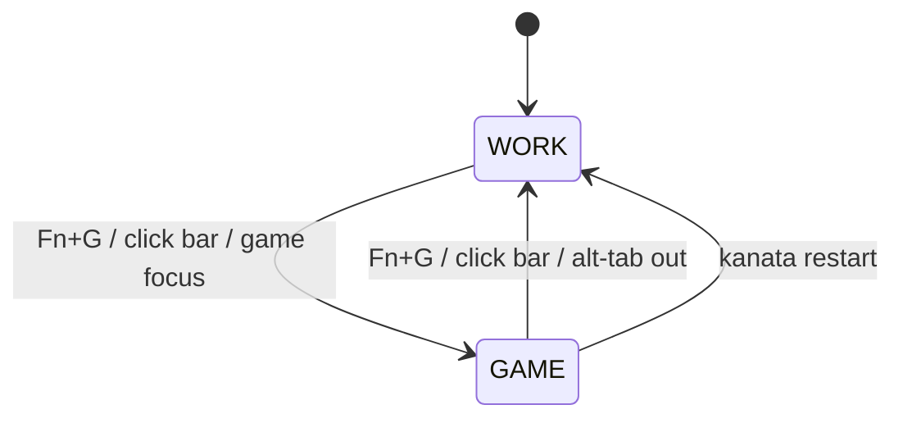
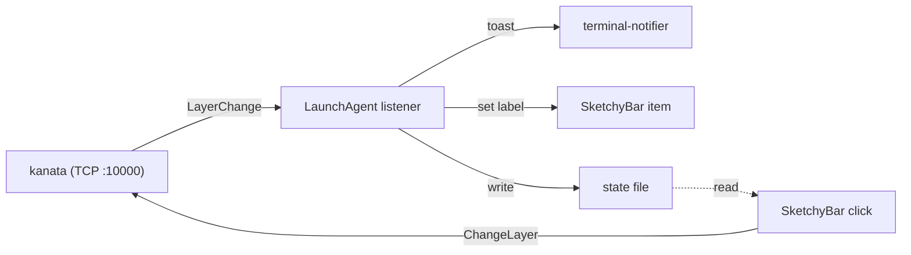

# Kanata Gaming Layer — Design

- **Date:** 2026-06-24
- **Status:** Approved design → ready for implementation plan
- **Scope:** macOS, MacBook built-in keyboard only (`~/.config/kanata/kanata.kbd`). The external ZSA Voyager is untouched by kanata and out of scope.

## Goal

Add a **gaming layer** in which every key fires its own keycode **instantly** — no home-row mods, no `space→nav` hold, no Hyper/Meh tap-holds — plus a **robust, elegant** way to flip between WORK and GAME and always know which mode is active.

Three ways to flip, all driving the **same** persistent base-layer state and all mirrored in the status bar:

1. **`Fn+G`** — keypress, both directions (enter from WORK, exit from GAME).
2. **Click the SketchyBar indicator** — mouse, both directions.
3. **App-focus auto-switch** — *opt-in, future* (see Out of Scope).

## Background — why a gaming layer is needed

`kanata.kbd` remaps only a **subset** of keys; everything else passes through plainly via `process-unmapped-keys yes`. So only these keys are "gaming-hostile" (their tap-hold/layer timing sabotages games):

| Key(s) | Base behavior (`kanata.kbd`) | Why it breaks gaming |
|--------|------------------------------|----------------------|
| **A S D F** | home-row mods `Ctrl/Shift/Alt/Cmd`, 180 ms hold (`:37–40`) | **The big one** — holding A/S/D to strafe/back > 180 ms fires a *modifier* instead of moving. (W is unmapped → already safe.) |
| **J K L ;** | mirrored home-row mods (`:41–44`) | breaks right-hand holds / arrow-style games |
| **Space** | tap=Space / hold=`nav` layer, 200 ms (`:54`) | hold-to-jump / fly / jetpack triggers the **nav layer** (arrows) instead of space |
| **Z X . /** | Hyper/Meh, 250 ms hold (`:47–50`) | holding Z (crouch) / X (ability) fires a Hyper/Meh combo |
| **Caps** | tap=Esc / hold=Ctrl (`:28`) | minor — Esc-tap is fine; hold=Ctrl rarely matters |

Everything else (W, Q, E, R, T, G, B, numbers, F-keys…) already fires instantly. **A gaming layer therefore means: explicitly map those keys to their plain selves, then flip in/out cleanly.**

## Design decisions

| # | Decision | Why | Source |
|---|----------|-----|--------|
| D1 | Use **`layer-switch`** (persistent base swap), **not** `layer-toggle`. | `layer-toggle` is misleadingly named — it is momentary (active only while held), maintainer-confirmed. `layer-switch` is the only "lock into a mode" action. | [kanata Discussion #1155](https://github.com/jtroo/kanata/discussions/1155), [config.adoc](https://github.com/jtroo/kanata/blob/main/docs/config.adoc) |
| D2 | Gaming layer is an **explicit identity layer** — neutralized keys mapped to their **literal** keycode, never transparent (`_`). | A `_` key falls through to the layer below (base) and would **re-import the home-row mods** — the exact timing we're removing. Rule: **literal = neutralize, `_` = inherit.** | [precondition HRM guide](https://precondition.github.io/home-row-mods), [QMK Layers](https://docs.qmk.fm/feature_layers) |
| D3 | Trigger = **`Fn+G`**, made symmetric via a `funcs-game` twin layer. | `Fn` is never used mid-game and a two-key press can't misfire; `G` = "Game" is mnemonic. Symmetric (same gesture both ways) is the most intuitive UX. | design choice |
| D4 | Feedback via kanata's **TCP server** (`--port 10000`) + a **user LaunchAgent listener**, **not** the `(cmd …)` action. | The stock **Homebrew** binary already ships the TCP server (`tcp_server` is a *default* cargo feature); `cmd` is a separate non-default feature needing a binary swap + `danger-enable-cmd` + re-granting Input Monitoring. TCP avoids all of that. | [Cargo.toml `default=["tcp_server",…]`](https://github.com/jtroo/kanata/blob/main/Cargo.toml), [args.rs `-p/--port`](https://github.com/jtroo/kanata/blob/main/src/main_lib/args.rs), [Homebrew formula](https://github.com/Homebrew/homebrew-core/blob/master/Formula/k/kanata.rb) |
| D5 | Feedback is **both** a `terminal-notifier` toast (on switch) **and** a persistent **SketchyBar** indicator. | No keyboard LEDs on macOS (Karabiner VirtualHID exposes none) → need an explicit, always-visible mode indicator. Toast confirms the flip; bar shows current state. | [tcp_protocol/src/lib.rs](https://github.com/jtroo/kanata/blob/main/tcp_protocol/src/lib.rs) |
| D6 | SketchyBar indicator is also a **clickable toggle**. | The TCP port is bidirectional — a click pushes `{"ChangeLayer":{"new":"…"}}` into kanata. Indicator + control in one. | [tcp_protocol `ClientMessage`](https://github.com/jtroo/kanata/blob/main/tcp_protocol/src/lib.rs) |
| D7 | Keep **`base` as the first `deflayer`**; daemon restart is the hard bailout. | kanata always boots into the first `deflayer`, so restarting the daemon is a guaranteed "return to WORK" escape hatch. | [config.adoc](https://github.com/jtroo/kanata/blob/main/docs/config.adoc) |

## Architecture

### Mode state machine



WORK = `base` layer, GAME = `gaming` layer. Both `Fn+G` and the bar click call `layer-switch` (or its TCP equivalent `ChangeLayer`), which swaps the **persistent base layer**. A daemon restart always lands on `base`.

### Layer model

| Layer | Role | Change |
|-------|------|--------|
| `base` | normal work (home-row mods, nav/funcs holds) | **edit:** add the `g` slot |
| `nav` | hold-Space navigation | **edit:** add the `g` slot (`_`) |
| `funcs` | hold-Fn media row | **edit:** `g → @game-on` (enter GAME) |
| **`gaming`** | identity layer — every key instant | **new** |
| **`funcs-game`** | hold-Fn twin of `funcs` for GAME, `g → @game-off` (exit) | **new** |

`Fn+G` is symmetric because `Fn` points at a *different* funcs layer per mode: in `base` it reaches `funcs` (`g`=enter); in `gaming` it reaches `funcs-game` (`g`=exit). `funcs-game` keeps the media row so brightness/volume still work while gaming.

### kanata config edits (`~/.config/kanata/kanata.kbd`)

**1. Add `g` to `defsrc`** (it's currently passthrough), inserted after `f` on the home-row line:

```lisp
(defsrc
  f1   f2   f3   f4   f5   f6   f7   f8   f9   f10  f11  f12
  caps
  a    s    d    f    g    j    k    l    ;     ;; ← g added
  z    x    .    /
  fn   ralt
  spc  h    y    u    i    o)
```

Every `deflayer` then gains one token at the matching position.

**2. New aliases:**

```lisp
(defalias
  game-on   (layer-switch gaming)                       ;; → GAME
  game-off  (layer-switch base)                          ;; → WORK
  fnl-game  (multi fn (layer-while-held funcs-game)))    ;; Fn in GAME (exit-aware)
```

**3. Edits to existing layers** (only the home-row line changes; `g` shown):

```lisp
(deflayer base    ;; … @a @s @d @f  g        @j @k @l @scln …)   ;; g = plain
(deflayer nav     ;; … lctl lsft lalt lmet  _  down up rght _ …) ;; g = passthrough
(deflayer funcs   ;; … _ _ _ _      @game-on _ _ _ _ …)          ;; Fn+G enters
```

**4. New `gaming` layer** (literal = neutralize, `_` = inherit):

```lisp
(deflayer gaming
  _    _    _    _    _    _    _    _    _    _    _    _   ;; F-row: plain
  esc                                                       ;; caps → instant Esc (pause menus)
  a    s    d    f    g    j    k    l    ;                  ;; home-row mods OFF
  z    x    .    /                                           ;; Hyper/Meh OFF
  @fnl-game  @hyp                                            ;; Fn → exit-funcs; ralt → Hyper kept
  spc  _    _    _    _    _)                                ;; space → nav OFF (literal space)
```

**5. New `funcs-game` layer** (copy of `funcs`, only `g` differs):

```lisp
(deflayer funcs-game
  brdn brup mctl sls dtn dnd prev pp next mute vold volu
  _
  _    _    _    _    @game-off  _    _    _    _            ;; Fn+G exits
  _    _    _    _
  _    _
  _    _    _    _    _    _)
```

### Feedback subsystem — data flow



- **kanata** pushes `{"LayerChange":{"new":"<layer>"}}` (newline-terminated JSON) to every connected TCP client on each layer change.
- The **listener** (user LaunchAgent) filters to the persistent states (`gaming`/`base`, ignoring transient `nav`/`funcs`/`funcs-game`), de-dupes, then: writes a **state file**, sets the **SketchyBar** label, fires a **terminal-notifier** toast. It auto-reconnects so a kanata restart doesn't kill it.
- The **SketchyBar click** reads the state file and pushes `{"ChangeLayer":{"new":"<opposite>"}}` back into kanata — closing the loop (click and keypress are interchangeable).

#### Reference: `~/.config/kanata/kanata-layer-listener.sh`

```bash
#!/bin/bash
# Subscribe to kanata's TCP layer events; drive SketchyBar + a terminal-notifier toast.
# Runs as a user LaunchAgent. LaunchAgents have a minimal PATH — set it explicitly.
export PATH="/opt/homebrew/bin:/usr/bin:/bin:/usr/sbin:/sbin:$PATH"
set -u
PORT="${KANATA_PORT:-10000}"
STATE="$HOME/.cache/kanata/layer"
mkdir -p "$(dirname "$STATE")"
last=""

notify() {
  case "$1" in
    gaming) icon="🎮"; word="GAME" ;;
    base)   icon="⌨️";  word="WORK" ;;
    *) return ;;
  esac
  printf '%s' "$1" > "$STATE"
  sketchybar --set kanata_mode label="$icon $word" 2>/dev/null
  terminal-notifier -title "kanata" -message "$icon $word mode" -group kanata-mode 2>/dev/null
}

while true; do
  if exec 3<>"/dev/tcp/127.0.0.1/$PORT" 2>/dev/null; then
    while IFS= read -r line <&3; do
      layer=$(printf '%s' "$line" | jq -r '.LayerChange.new // empty' 2>/dev/null)
      case "$layer" in
        gaming|base) ;;          # persistent states we reflect
        *) continue ;;           # ignore transient nav/funcs/funcs-game
      esac
      [ "$layer" = "$last" ] && continue
      last="$layer"; notify "$layer"
    done
    exec 3<&- 3>&-
  fi
  sleep 1                        # kanata down or restarted — reconnect
done
```

#### Reference: `~/.config/sketchybar/plugins/kanata_mode.sh`

```bash
#!/bin/bash
export PATH="/opt/homebrew/bin:/usr/bin:/bin:$PATH"
STATE="$HOME/.cache/kanata/layer"
PORT="${KANATA_PORT:-10000}"
case "$SENDER" in
  mouse.clicked)                                   # click → flip via TCP
    cur=$(cat "$STATE" 2>/dev/null)
    [ "$cur" = "gaming" ] && next="base" || next="gaming"
    printf '{"ChangeLayer":{"new":"%s"}}\n' "$next" | nc -w1 127.0.0.1 "$PORT" ;;
  *)                                               # initial render
    cur=$(cat "$STATE" 2>/dev/null)
    [ "$cur" = "gaming" ] && sketchybar --set "$NAME" label="🎮 GAME" \
                          || sketchybar --set "$NAME" label="⌨️ WORK" ;;
esac
```

Item definition (added inline to `laptop_bar`, optionally `4k_desktop_bar`):

```bash
sketchybar --add item kanata_mode right \
           --set kanata_mode label="⌨️ WORK" \
                 click_script="$PLUGIN_DIR/kanata_mode.sh" \
           --subscribe kanata_mode mouse.clicked
```

#### kanata plist change (`dev.kanata.kanata.plist`)

Insert `--port 10000` into `ProgramArguments` (after `--no-wait`). kanata normalizes a bare port to `127.0.0.1:10000` (loopback only — no firewall prompt). kanata stays a **root LaunchDaemon**; the listener is a **user LaunchAgent** so its `sketchybar`/`terminal-notifier` calls reach the Aqua session.

#### Listener LaunchAgent (`dev.kanata.layer-listener.plist`)

`Label dev.kanata.layer-listener`, `ProgramArguments = [/bin/bash, …/kanata-layer-listener.sh]`, `RunAtLoad=true`, `KeepAlive=true`, logs to `/tmp/kanata-listener.{out,err}.log`. Loaded as a **user** agent: `launchctl bootstrap gui/$(id -u) ~/Library/LaunchAgents/dev.kanata.layer-listener.plist`.

### Escape hatches (robustness)

1. **`Fn+G`** or **bar click** — both flip either direction.
2. **Hard reset:** restart the daemon (`sudo launchctl kickstart -k system/dev.kanata.kanata`) → boots into `base`/WORK (D7).
3. **Optional belt-and-suspenders:** a both-Shifts chord → `@game-off` on every layer via `defchordsv2` (its exact syntax is version-specific/experimental — **verify against the installed kanata version during implementation** before adding).

## Components & files changed

| File | Change |
|------|--------|
| `.config/kanata/kanata.kbd` | add `g` to `defsrc`; 3 aliases; `g` slot in `base`/`nav`; `g=@game-on` in `funcs`; new `gaming` + `funcs-game` layers |
| `.config/kanata/dev.kanata.kanata.plist` | add `--port 10000` |
| `.config/kanata/kanata-layer-listener.sh` | **new** — TCP listener |
| `.config/kanata/dev.kanata.layer-listener.plist` | **new** — user LaunchAgent for the listener |
| `.config/sketchybar/plugins/kanata_mode.sh` | **new** — click handler / renderer |
| `.config/sketchybar/laptop_bar` (and/or `4k_desktop_bar`) | add `kanata_mode` item |
| `setup_mac.sh` | document loading the listener LaunchAgent + pre-create `~/.cache/kanata` (mirrors existing kanata daemon notes) |

`.config/kanata` and `.config/sketchybar` are already symlinked from dotfiles, so new files deploy automatically.

## Validation

- **Config compiles:** reload via `scripts/kanata-reload.sh`, watch `/tmp/kanata.err.log` for parse errors (optionally `kanata --cfg kanata.kbd --check` if the flag exists on the installed version).
- **Neutralization:** in GAME, type `asdf`/`jkl;` → letters, no modifiers; hold Space → repeats space, no nav; hold Z/X → plain z/x.
- **Toggle:** `Fn+G` → toast `🎮 GAME` + bar shows GAME; `Fn+G` again → `⌨️ WORK`.
- **Bar click:** clicking the item flips and the toast/label follow.
- **Bailout:** `launchctl kickstart` of the daemon returns to WORK.
- **Listener resilience:** restart kanata → listener reconnects within ~1 s and still updates on the next switch.

## Risks & gotchas

- **LaunchAgent PATH** is minimal — scripts must set `PATH` (or use absolute paths) to find `sketchybar`/`terminal-notifier`/`jq`/`nc`. Handled in the reference scripts.
- **Transient layer events:** kanata emits `LayerChange` for `nav`/`funcs` too; the listener must filter to `gaming`/`base` and de-dupe (handled) or it would toast on every Space/Fn hold.
- **`ralt` in GAME stays Hyper** (`@hyp`) for window management; if a specific game binds Right-Option, change that slot to literal `ralt`.
- **`caps → esc` in GAME** loses Caps-Lock; swap to literal `caps` if a game needs it.
- **defchordsv2 syntax** is experimental — verify before adding the panic chord (kept optional for this reason).

## Out of scope / future

- **App-focus auto-switch:** a focus watcher (e.g. driven by yabai/skhd signals, or a small daemon like `7mind/kanata-switcher`) that pushes `{"ChangeLayer":{"new":"gaming"}}` when a game app is frontmost and `base` on blur. Foundation already exists (D6, bidirectional TCP) — purely additive later.
- **Per-game profiles**, custom in-game remaps, arrow clusters, macros — deliberately excluded (smallest slice that proves the toggle).

## Sources

- kanata: [config.adoc](https://github.com/jtroo/kanata/blob/main/docs/config.adoc) · [tcp_protocol/src/lib.rs](https://github.com/jtroo/kanata/blob/main/tcp_protocol/src/lib.rs) · [args.rs (`-p/--port`)](https://github.com/jtroo/kanata/blob/main/src/main_lib/args.rs) · [Cargo.toml feature table](https://github.com/jtroo/kanata/blob/main/Cargo.toml) · [Discussion #1155 (layer-switch vs toggle)](https://github.com/jtroo/kanata/discussions/1155) · [Discussion #1455 (skip HRM for gaming)](https://github.com/jtroo/kanata/discussions/1455) · [Discussion #997 (TCP scripts)](https://github.com/jtroo/kanata/discussions/997)
- [Homebrew kanata formula](https://github.com/Homebrew/homebrew-core/blob/master/Formula/k/kanata.rb) · [precondition home-row-mods guide](https://precondition.github.io/home-row-mods) · [QMK Layers](https://docs.qmk.fm/feature_layers) · [ZMK Layer Behaviors](https://zmk.dev/docs/keymaps/behaviors/layers)
- Tools: [SketchyBar](https://github.com/FelixKratz/SketchyBar) · [terminal-notifier](https://github.com/julienXX/terminal-notifier) · [7mind/kanata-switcher](https://github.com/7mind/kanata-switcher) (focus-based switching reference)
