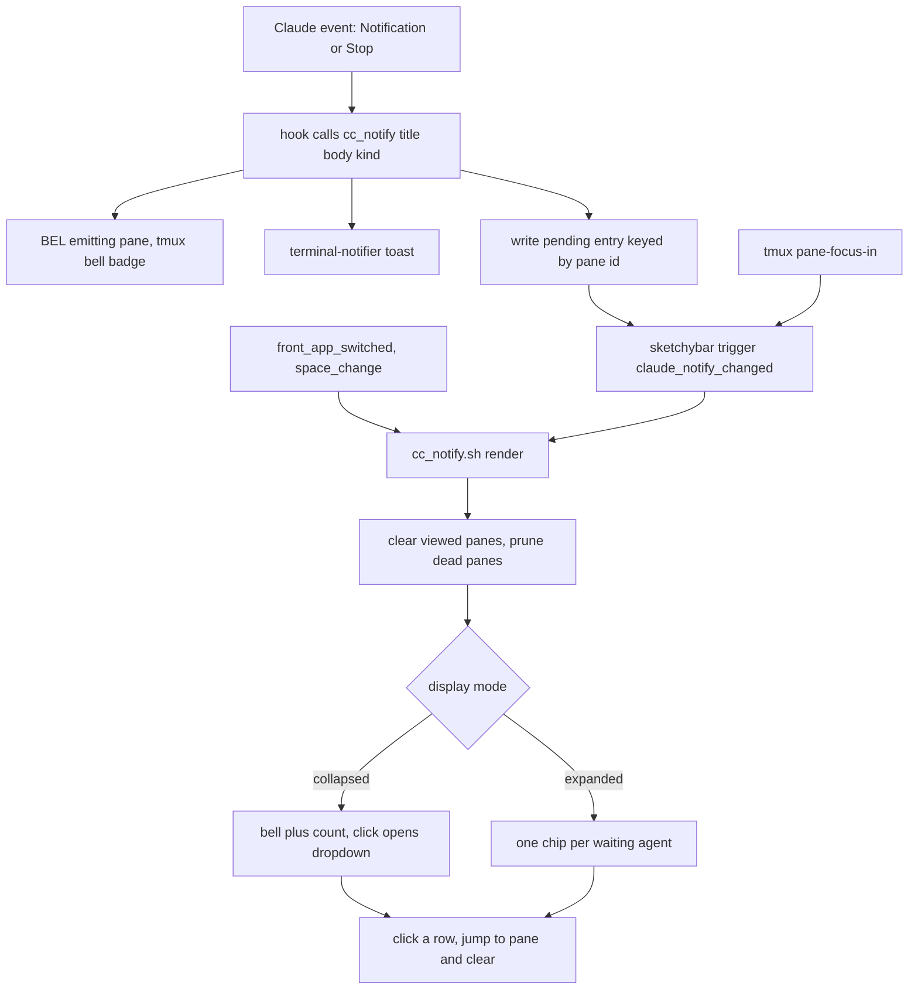

# SketchyBar Claude-agent notification chips: a persistent, pane-precise "who's waiting on me" indicator

**Date:** 2026-06-24
**Status:** Designed — not yet implemented
**Scope:** macOS (tmux + WezTerm + SketchyBar + yabai). Claude running outside tmux degrades gracefully (toast only, no chip).

## Problem

Multiple Claude Code agents run in different tmux tabs/panes. The earlier session
(`docs/superpowers/specs/2026-06-23-claude-tmux-wezterm-notifications-design.md`) gave each a
**toast** (transient) and a **tmux bell badge** (only visible when you're already looking at that
WezTerm window / tmux session). Neither is an always-visible, global, *persistent* answer to
**"which agents are still waiting on me right now?"** when you're off in Unity, a browser, another
WezTerm window, or another tmux session.

We want that answer on **SketchyBar** — always on screen, across all spaces — as **clickable chips
that survive until you actually visit the agent**, each jumping to the exact tmux pane in one click.

## Background — what already exists (and stays)

- **Two Claude hooks**, both calling `cc_notify "<title>" "<body>"` in `claude/hooks/lib/notify-lib.sh`:
  - `Notification` (Claude needs permission/input) → `claude-notify.sh` → always fires.
  - `Stop` (turn finished) → `claude-stop-notify.sh` → **focus-gated**: fires only when you are *not*
    looking at Claude's pane.
- `cc_notify` does two things today: (1) **BELs the emitting tmux pane** → tmux sets
  `window_bell_flag` → renders a peach 󰂞 badge on that tab (auto-clears when you visit the window);
  (2) pops a clickable **`terminal-notifier`** toast whose `-execute` runs
  `tmux switch-client / select-window / select-pane` + `open -b com.github.wez.wezterm` to jump to
  the emitting pane.
- **SketchyBar** patterns to build on:
  - `kanata_mode` — a clickable right-side item driven by a state file + `sketchybar --set` (a
    LaunchAgent listener pushes live updates).
  - `spaces` — an invisible **broker** item (`drawing=off updates=on`) subscribed to events that
    re-renders the whole strip on each trigger; yabai is the source of truth, plain items are drawn
    dynamically (`docs/superpowers/specs/2026-06-24-yabai-dynamic-workspaces-design.md`).

This feature is **purely additive**: the bell badge and the toast are unchanged; `cc_notify` gains a
4th action and SketchyBar gains a new broker + dynamic items.

## Why not just ride tmux's `window_bell_flag`?

The bell flag is the cheapest "uncleared" signal, but it is **per-window, not per-pane** — and the
user runs a **mix** of one-agent-per-tab *and* several-agents-as-panes-in-one-window. Window-level
granularity can't say *which pane* needs you, can't distinguish *needs-input* from *finished*, and
lights up for **any** bell (a vim beep, not just Claude). So we keep a **Claude-only, pane-keyed
pending store** instead. (The window bell badge still rides the flag — that part is fine and stays.)

## Decision

A small **pending store** the hooks write to, rendered by a SketchyBar **broker** into either inline
chips or a dropdown, with all clearing/pruning centralized in the render plugin.

## Components

| File | Role |
|------|------|
| `claude/hooks/lib/notify-lib.sh` | `cc_notify "<title>" "<body>" [kind]` — after the existing BEL + toast, when inside tmux: write `~/.cache/claude-notify/pending/<pane-id>` (content = `kind`) and `sketchybar --trigger claude_notify_changed`. `kind` defaults to `notification`. |
| `claude/hooks/claude-notify.sh` | Passes `kind=notification`. |
| `claude/hooks/claude-stop-notify.sh` | Passes `kind=stop` (still focus-gated). |
| `.config/sketchybar/plugins/cc_notify.sh` | The broker/render + click handler. Branches on `$SENDER` (render vs `mouse.clicked`) and `$NAME`/`$BUTTON` (anchor vs agent, left vs right). |
| `.config/sketchybar/sketchybarrc` | Adds `event claude_notify_changed`; the `cc_notify` anchor item (right, hidden when empty) subscribed to `claude_notify_changed mouse.clicked front_app_switched space_change`; initial trigger. |
| `tmux/tmux.conf` | `set -g focus-events on`; `set-hook -g pane-focus-in 'run-shell -b "sketchybar --trigger claude_notify_changed"'`. |
| `claude/hooks/tests/` | Tests for write-on-notify, prune-dead, clear-viewed, label formatting, mode toggle. |

## The pending store (source of truth)

- Directory: `~/.cache/claude-notify/pending/`. **One file per waiting agent, named by tmux pane id**
  (e.g. `%23`; sanitized to its numeric part for the SketchyBar item name `cc_notify.agent.23`,
  reconstructed as `%23` when targeting tmux). Keying by pane id gives natural **dedup** (a pane that
  fires twice stays one entry) and **pane-level precision**.
- File content: just the **kind** (`notification` | `stop`) (+ optional epoch for future age display).
- Everything else (session, window name, cwd) is **re-queried live from tmux at render time** via
  `tmux display-message -t <pane> ...`. Benefit: labels never go stale after a rename, and a pane
  that no longer exists makes the query fail → the entry is pruned. The store holds the *minimum*.
- Mode file: `~/.cache/claude-notify/mode` holding `collapsed` (default) or `expanded`.
- **Outside tmux** (`$TMUX_PANE` empty): no pending entry is written (nothing to jump to). The toast
  still fires via the existing path.

## Hook change (small, low-risk)

`cc_notify` adds a `kind` parameter and, **only when in tmux**, two lines after the existing
behavior: write the pending file keyed by `$TMUX_PANE`, then trigger SketchyBar. The two hook
scripts pass their kind. Nothing about the BEL, the toast, or the focus-gate changes.

`sketchybar` must resolve on `PATH` in the hook context — use `command -v sketchybar` with a
`/opt/homebrew/bin/sketchybar` fallback (same defensive pattern the tmux hook needs).

## SketchyBar items & interactions

- **Anchor** `cc_notify` (right cluster, left of the `kanata_mode` indicator — the only active
  right-side item today; clock/volume/battery are commented out): icon 󰂞 + count label;
  `drawing=off` when the pending count is 0 so the bar stays clean.
- **Per-agent items** `cc_notify.agent.<id>`: **rebuilt every render** — `sketchybar --remove
  '/cc_notify\.agent\..*/'` then re-add one per pending file. Drawn as **inline chips** (expanded
  mode) or **popup rows** under the anchor (`popup.cc_notify`, collapsed mode).
- **Display modes**, switched at runtime via the `mode` file:
  - **collapsed** (default): anchor shows 󰂞 + count; **left-click** toggles the dropdown
    (`--set cc_notify popup.drawing=toggle`).
  - **expanded**: anchor shows 󰂞 (+count); inline chips follow it.
- **Gestures** (plugin branches on `$NAME` + `$BUTTON` for `mouse.clicked`; verify SketchyBar's
  click env var name — `BUTTON`/`MODIFIER` — at implementation time):
  - **Left-click anchor** → open/close dropdown (collapsed).
  - **Right-click anchor** → toggle `collapsed`↔`expanded` (write the mode file, re-trigger render).
  - **Left-click an agent** (chip or popup row) → run the jump command (below) + delete that pending
    file + re-trigger render.
  - **"✕ clear all"** row at the bottom of the dropdown → delete all pending files + re-render.
- **Jump command** (reuse the spec's proven sequence; absolute `tmux` path, target the pane id):
  `tmux switch-client -t '<session>' ; tmux select-window -t '%<id>' ; tmux select-pane -t '%<id>' ; /usr/bin/open -b com.github.wez.wezterm`.

## Clearing & hygiene (centralized in the render plugin)

Every render does, in order:
1. **Clear-on-visit** — delete pending files for panes currently being *viewed*. A pane is "viewed"
   iff `pane_active && window_active && session_attached` (one `tmux list-panes -a -F` query). This
   mirrors the tmux bell auto-clear but is pane-precise.
2. **Prune** — delete pending files whose pane id is not in the live pane set (agent's pane closed).
3. **Render** the remaining entries per the current mode.

A render is triggered by: `cc_notify` (on fire), the tmux `pane-focus-in` hook (so switching panes
clears the one you just opened), and `front_app_switched` / `space_change` (cheap safety nets when
you tab back to WezTerm or change space). Click handlers also delete + re-trigger.

## tmux change

`set -g focus-events on` enables `pane-focus-in`; the hook fires the trigger (backgrounded with `-b`
so it never blocks). `sketchybar` needs an absolute path or an exported PATH inside `run-shell`
(tmux's `run-shell` gets a minimal environment).

## Recommended defaults

| Decision | Value |
|---|---|
| **Label** | tmux window name; fall back to cwd basename (repo) if the name is generic/numeric; truncate ~12 chars |
| **Position** | right side, left of the `kanata_mode` indicator (one-line reorder later) |
| **Default mode** | `collapsed` (right-click to expand) |
| **Colors (Catppuccin Frappe)** | needs-input 󰂞 peach/red (`#ef9f76`/`#e78284`) · finished 󰗠 green (`#a6d189`) |
| **Clear-all** | a "✕ clear all" row at the bottom of the dropdown |

## Testing

Extend `claude/hooks/tests/`:
- `cc_notify` writes a pending file keyed by pane id (and only when in tmux); kind is recorded.
- Prune removes entries for dead panes; keeps live ones.
- Clear-viewed removes entries for the active/attached/visible pane only.
- Label formatting (window-name → cwd fallback, truncation).
- Mode toggle flips the mode file and the render output (chips vs popup).

Factor the pure logic (parse pending dir, "viewed" rule, label format, mode) into a lib with `tmux`
mocked so it's unit-testable without a live SketchyBar/tmux. Run via `claude/hooks/tests/run-tests.sh`.

## Edge cases / caveats

- **Multiple WezTerm windows:** `open -b` raises the app's most-recent window, which may not host the
  target tmux client — tmux still selects the right window/pane; GUI-window focus is approximate
  (same caveat as the toast).
- **`focus-events off`:** if disabled, clearing lags until the next trigger (`front_app_switched`
  when you tab away/back, or the next notify). We enable it.
- **Stale entry after a crash:** pruning on every render (dead-pane check) covers a pane that closed
  without being visited.
- **Trigger PATH:** both the hook and the tmux `run-shell` must find `sketchybar` (absolute path /
  exported PATH).

## Out of scope (v1)

- Claude running **outside tmux** (no pane to jump to — toast still fires, no chip).
- The **second-monitor** `external_bar` (binary not installed; same deferral as the spaces strip).
- A **"long task only"** heuristic for the Stop chip (suppress turns under N seconds).
- **Age/elapsed** display on chips (epoch is recorded but unused in v1).
