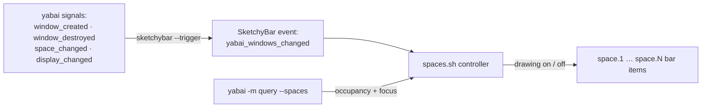

# Dynamic Workspaces on yabai (SketchyBar) — Design

- **Date:** 2026-06-24
- **Status:** Approved design → ready for implementation plan
- **Scope:** macOS only — `~/.config/sketchybar/*` and `~/.config/yabai/yabairc`. yabai stays the window manager; skhd keybindings, jankyborders, window rules, and the SIP scripting addition (`yabai --load-sa`) are **untouched**.

## Goal

Make the workspace strip *feel* like i3/sway dynamic workspaces, on top of yabai:

- **Boot / light usage:** the bar shows only the spaces actually in use (and the one you're on). Empty spaces are hidden, so a fresh session reads as "just `1`".
- **`alt+5`:** jump to space 5; put a window on it and **`5` appears** in the bar — the "create on demand" experience.
- **Switch `1`↔`5`:** unchanged (`alt+1` / `alt+5`).
- **Auto-cleanup:** empty the last window on a space and leave it → it **disappears** from the bar.

…with **zero runtime space create/destroy**, so it cannot trigger the per-Space compositing corruption documented in `[[Diagnosing a Corrupted macOS Space]]` and there is nothing macOS-version-fragile to break.

## Background — why this shape

**Today** (`sketchybarrc:48-63`) the bar loops over *every* existing native space on display 1 and draws one item each; combined with 10 pre-created Mission Control spaces, the strip always shows `1…10`. yabai's `alt-N → space --focus N` and skhd are fine — the staleness is purely in the bar.

**Live state at design time** (`yabai -m query --spaces`): **10 spaces, all on display 1** (1800×1169, the notched 14"); no labels set; occupancy is `\(.windows | length)`. Right now spaces **6, 8, 9 are empty** and **5 is focused** — so a dynamic bar would show `1 2 3 4 5 7 10` and hide `6 8 9`.

**Two roads not taken** (both deliberately rejected — see decisions):

1. **AeroSpace** would give virtual dynamic workspaces natively, but it drives windows through the synchronous macOS **Accessibility API**, which **stalls hard on Unity Editor** ([AeroSpace #497 "3s+ lag when switching to space with unity editor"](https://github.com/nikitabobko/AeroSpace/issues/497)); Unity Editor exposes no AX window handle (noted on `[[yabai]]`). yabai's SkyLight/scripting-addition path manipulates windows *below* the app's main thread and stays responsive. **yabai stays.**
2. **True create/destroy** (literally one space at boot, `space --create`/`--destroy` on the fly) is the most literal match — but it is *exactly* the **"heavy Space churn"** that `[[Diagnosing a Corrupted macOS Space]]` (2026-06-22) identified as a likely cause of the per-Space menu-bar corruption, and `space --destroy` already broke on macOS Tahoe ([yabai #2730](https://github.com/koekeishiya/yabai/issues/2730)). Rejected for robustness.

The chosen approach — **fixed pool + dynamic bar** — delivers the *experience* with none of the churn: the dynamic behavior lives entirely in SketchyBar; real spaces are never created or destroyed at runtime.

## Design decisions

| # | Decision | Why | Source |
|---|----------|-----|--------|
| D1 | **Stay on yabai**, do not migrate to AeroSpace. | AeroSpace's AX-API drive freezes on Unity Editor (3s+); yabai's SkyLight path stays responsive with heavy apps. | [AeroSpace #497](https://github.com/nikitabobko/AeroSpace/issues/497), [#604](https://github.com/nikitabobko/AeroSpace/issues/604), `[[yabai]]` Unity-no-AX-handle note |
| D2 | **Fixed space pool; never create/destroy at runtime.** Keep the existing 10. | Create/destroy = "heavy Space churn", the suspected trigger of the per-Space compositing corruption already hit; `space --destroy` is broken on macOS Tahoe. | `[[Diagnosing a Corrupted macOS Space]]`, [yabai #2730](https://github.com/koekeishiya/yabai/issues/2730) |
| D3 | The "dynamic" feel is **100% in the bar**: a space draws **iff `windows > 0` OR `has-focus`**. | Empty+unfocused → hidden ("auto-cleanup"); focused-but-empty stays visible so you always see where you are. No window-manager changes needed. | live `--query --spaces` shape |
| D4 | **One controller plugin** does a single `yabai -m query --spaces` per event and sets all items — not per-item polling. | N space items each running a full query per event is wasteful; one query → one batched `sketchybar --set …` chain. | SketchyBar event model |
| D5 | Use **plain SketchyBar `item`s**, not the native `space` component. yabai is the single source of truth for focus + occupancy. | Sidesteps the native `space` component's dynamic show/hide + ordering quirks ([SketchyBar #754](https://github.com/FelixKratz/SketchyBar/issues/754), [#701](https://github.com/FelixKratz/SketchyBar/discussions/701)); click-to-focus and highlight are trivial to drive ourselves. | SketchyBar docs |
| D6 | **Per-display** logic (loop spaces grouped by `.display`), even though single-display today. | Scales cleanly when an external monitor is attached; matches the existing per-display bar split. | live `--query --displays` |
| D7 | **Keybindings unchanged** (skhd `alt-N` focus, `shift+alt-N` move). | They already address a fixed pool by index; the dynamic feel comes only from the bar. | `skhdrc:4-26` |
| D8 | **"Occupied" = ≥1 window of any kind** (managed *or* floating). | Simplest, predictable; a floating utility (you have many `manage=off` rules) keeps its space visible. *(Alt: count managed-only.)* | design choice |

## Architecture

### Data flow

yabai emits signals on window/space/display changes → each fires `sketchybar --trigger yabai_windows_changed` → the controller plugin queries yabai once and toggles every space item's `drawing`/highlight.



### The drawing rule

For each space *N*: `drawing = on` iff `has-focus == true` **OR** `(windows | length) > 0`; else `off`. The focused space additionally gets the selected highlight (`background.drawing=on`). This is the whole behavior.

### Reference: `~/.config/sketchybar/plugins/spaces.sh` (controller)

```bash
#!/bin/bash
# Dynamic workspace strip for yabai: one query per event, show a space iff
# it has windows OR is focused. Triggered by yabai signals (see yabairc).
export PATH="/opt/homebrew/bin:/usr/bin:/bin:$PATH"

args=()
while read -r idx focus nwin; do
  if [[ "$focus" == "true" || "$nwin" -gt 0 ]]; then draw="on"; else draw="off"; fi
  args+=(--set "space.$idx" drawing="$draw" background.drawing="$focus")
done < <(yabai -m query --spaces | jq -r '.[] | "\(.index) \(.["has-focus"]) \(.windows | length)"')

[[ ${#args[@]} -gt 0 ]] && sketchybar "${args[@]}"
```

### Reference: `sketchybarrc` (replaces the `:48-82` space block)

```bash
sketchybar --add event yabai_windows_changed

# One visual item per space in the pool (plain items, yabai is source of truth).
for sid in $(yabai -m query --spaces | jq -r '.[].index'); do
  sketchybar --add item space."$sid" left \
             --set space."$sid" icon="$sid" label.drawing=off drawing=off \
                   icon.padding_left=7 icon.padding_right=7 \
                   background.color=0x40ffffff background.corner_radius=5 background.height=25 \
                   click_script="yabai -m space --focus $sid"
done

# A single (invisible) controller reacts to events and drives all space items.
sketchybar --add item spaces_controller left \
           --set spaces_controller drawing=off script="$PLUGIN_DIR/spaces.sh" \
           --subscribe spaces_controller yabai_windows_changed space_change \
                       front_app_switched display_change
sketchybar --trigger yabai_windows_changed   # initial paint
```

### Reference: `yabairc` signal additions

yabai already has `space_changed`, `window_destroyed`, and `display_changed` signals (for focus); add a `--trigger` so the bar recomputes. yabai allows multiple signals per event, so these can be added without disturbing the existing focus signals:

```bash
yabai -m signal --add event=window_created   action="sketchybar --trigger yabai_windows_changed"
yabai -m signal --add event=window_destroyed  action="sketchybar --trigger yabai_windows_changed"
yabai -m signal --add event=space_changed     action="sketchybar --trigger yabai_windows_changed"
yabai -m signal --add event=display_changed   action="sketchybar --trigger yabai_windows_changed"
```

## Components & files changed

| File | Change |
|------|--------|
| `.config/sketchybar/sketchybarrc` | Replace the space-creation block (`:48-82`): add `yabai_windows_changed` event, create plain per-space items, add the `spaces_controller` item + subscription, trigger initial paint. |
| `.config/sketchybar/plugins/spaces.sh` | **new** — controller (above). The old `plugins/space.sh` (which only toggled `background.drawing` on `$SELECTED`) is superseded and removed. |
| `.config/yabai/yabairc` | Add 3-4 `sketchybar --trigger yabai_windows_changed` signals (`window_created`/`window_destroyed`/`space_changed`/`display_changed`). |
| `.config/sketchybar/4k_desktop_bar`, `laptop_bar`, `external_bar` | Multi-display only: ensure the controller logic runs per-display. Single-display today → handled in the plan, not blocking. |

`.config/sketchybar` and `.config/yabai` are already symlinked from dotfiles, so changes deploy on the next `sketchybar --reload` / `yabai --restart-service`.

## Validation

- **Initial paint:** reload sketchybar → with the live state above, bar shows `1 2 3 4 5 7 10`, hides `6 8 9`, highlights `5`.
- **Appear-on-demand:** `alt+6` (empty) → `6` shows (focused-empty rule); open a window → stays; `alt+1` away while `6` empty → `6` hides.
- **Auto-cleanup:** close the last window on a space and switch away → it disappears within one signal.
- **Switch/move still work:** `alt+5` focuses; `shift+alt+5` moves a window (and the source space hides if it empties).
- **No churn:** `grep -rE 'space --(create|destroy)'` over the configs returns nothing.
- **Resilience:** `yabai --restart-service` and `sketchybar --reload` both rebuild the strip correctly; `external_bar` (when present) still reserves bar height via `external_bar all:25:0`.

## Risks & gotchas

- **Two near-identical event namespaces (not a typo):** SketchyBar's own events are present-tense (`space_change`, `display_change`, `front_app_switched`); yabai's signal events are past-tense (`space_changed`, `display_changed`, `window_created`). Both are used on purpose — yabai signals re-trigger our controller, and subscribing to SketchyBar's own events *also* catches changes yabai didn't drive (e.g. a manual Mission Control swipe).
- **Signal `action` escaping:** yabairc already does fiddly quoting at `:63,70`; the new `--trigger` actions are simple strings, but keep them un-nested.
- **Trigger frequency:** `window_created`/`window_destroyed` fire often; the controller does one cheap query and one batched set. If it ever feels chatty under rapid window churn, debounce in `spaces.sh`.
- **Floating windows count (D8):** a lone `manage=off` utility keeps its space visible. Intended; switch the query to managed-only if it bugs you.
- **Focused-empty space stays visible (D3):** by design (you must see where you are). Not a bug.
- **Multi-display:** each display needs the controller to address its own items; the `external_bar` wiring is deferred to the plan since you're single-display now.
- **`PATH` in plugins:** SketchyBar plugins inherit a minimal PATH — `spaces.sh` sets it so `yabai`/`jq` resolve (mirrors the kanata plugins).

## Out of scope / future

- **True create/destroy / a literally-single space at boot** — rejected (D2); revisit only if Mission Control tidiness ever outweighs the corruption/fragility risk.
- **AeroSpace / any AX-API WM** — rejected (D1) while Unity is a daily driver.
- **Trimming the pool below 10**, auto-renumbering/compaction, per-app workspace assignment — deliberately excluded (smallest slice that delivers the dynamic feel).

## Sources

- AeroSpace perf vs heavy apps: [#497 (Unity 3s+ lag)](https://github.com/nikitabobko/AeroSpace/issues/497) · [#604 (wake/display freeze)](https://github.com/nikitabobko/AeroSpace/issues/604) · [#526 (Xcode freeze)](https://github.com/nikitabobko/AeroSpace/issues/526)
- yabai: [#2730 (`space --destroy` broken on Tahoe)](https://github.com/koekeishiya/yabai/issues/2730) · [Commands wiki](https://github.com/koekeishiya/yabai/wiki/Commands)
- SketchyBar: [items/events docs](https://felixkratz.github.io/SketchyBar/config/items) · dynamic `space` quirks [#754](https://github.com/FelixKratz/SketchyBar/issues/754) · [#701](https://github.com/FelixKratz/SketchyBar/discussions/701)
- Internal: `[[Diagnosing a Corrupted macOS Space]]` (2026-06-22), `[[yabai]]` (Unity-no-AX-handle caveat)
- Live: `yabai -m query --spaces` / `--displays` on this machine, 2026-06-24
