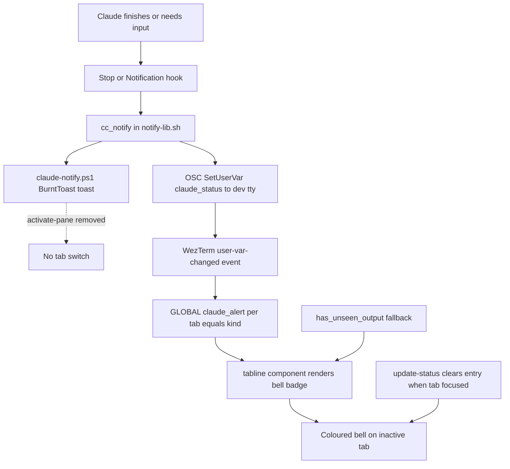

# WezTerm: elegant, non-switching Claude notification tab badge (Windows)

_Date: 2026-06-25 · Status: design approved, ready for plan · Platform: Windows 11 + WezTerm_

## Problem

On Windows, when Claude Code finishes a turn (`Stop` hook) or needs the user
(`Notification` hook), WezTerm **auto-switches to Claude's tab**, yanking focus away
from whatever the user was doing. The user wants the elegant tmux behaviour instead:
**do not switch**, and show a **bell badge** on the tab that rang — optionally with a
distinct colour per state — that **clears when the tab is visited**.

### Root cause (confirmed by reading the code)

| Layer | Behaviour | Location |
|---|---|---|
| The auto-switch | `if ($PaneId) { wezterm cli activate-pane --pane-id $PaneId }` runs on **every** notification — unconditional focus-steal, no click | `C:\Tools\claude-notify.ps1:13-16` |
| Why `-PaneId` is always supplied | Both hooks call `cc_notify`, which passes `-PaneId "$WEZTERM_PANE"` on Windows | `claude/hooks/lib/notify-lib.sh:80` |
| Why there is no badge today | The in-terminal BEL cue is gated on `$TMUX`, which is unset under WezTerm on Windows, so nothing ever flags the tab | `claude/hooks/lib/notify-lib.sh:54-65` |
| The reference behaviour (tmux) | `monitor-bell on` + `bell-action any` + a peach `󰂞` badge in `@catppuccin_window_text` that does not switch and auto-clears on visit | `tmux/tmux.conf:32-33,80` |
| Already-available WezTerm primitive | tabline.wez ships an `output` tab component (bell glyph on `has_unseen_output`), currently commented out | `.config/wezterm/wezterm.lua:506` |

macOS wires the same jump intent as a **click** action (`terminal-notifier -execute`);
the Windows port focuses immediately and unconditionally. That is the entire bug.

## Goals

1. Claude notifications **never auto-switch** the WezTerm tab.
2. A **bell badge** appears on the inactive tab that fired, styled on the Catppuccin
   Frappe palette, and **clears when the tab is visited**.
3. The badge distinguishes **"needs you / permission"** from **"finished"** by colour.
4. The desktop toast (BurntToast) is **retained** — only the focus-steal is removed.
5. The notifier script becomes **version-controlled and reproducible** (no hand-placed
   machine-local file).

## Non-goals / out of scope

- **Zellij layer.** Confirmed the user runs Claude in **separate WezTerm tabs**, not
  inside Zellij. A Zellij-side cue (for the `agents.kdl` layout) is a possible future
  follow-up, not part of this work.
- **Click-to-jump on the toast.** Removing the auto-switch is the requirement. A proper
  BurntToast click→focus affordance (protocol activation) is a possible future nicety,
  explicitly deferred.
- macOS / Linux delivery is unchanged.

## Architecture

Two independent halves; the badge unifies a precise signal with a zero-signal fallback.



**"Both" is unified into one badge with a precedence rule** (rather than two competing
glyphs):

1. **Precise tier** — if `GLOBAL.claude_alert` has an entry for any of the tab's panes →
   bright, per-state coloured bell.
2. **Fallback tier** — else if a pane in the tab has `has_unseen_output` → dim outline bell.
3. Else → nothing.

The precise tier depends on an OSC sequence reaching WezTerm through Claude's fullscreen
TUI. The fallback tier needs **no signal at all** (WezTerm tracks `has_unseen_output`
natively), so if the OSC path ever misfires the feature degrades to an uncoloured,
non-switching badge instead of breaking.

## Part 1 — Remove the auto-switch (the fix)

1. **Vendor** the notifier into the repo at `claude/hooks/bin/claude-notify.ps1`. It rides
   the existing `claude/ → ~/.claude/` symlink, so no new deploy logic is required.
2. **Delete** the `if ($PaneId) { … activate-pane … }` block. The BurntToast call stays.
3. **De-hardcode** `notify-lib.sh`: resolve the notifier relative to the lib's own
   location and `cygpath -w` it for `powershell.exe -File`, removing the literal
   `C:\Tools\claude-notify.ps1`. The `-PaneId` argument is dropped (no longer used by the
   script; the badge signal travels via OSC, see Part 2).
4. Leave the old `C:\Tools\claude-notify.ps1` in place but unused (harmless); the repo copy
   is now authoritative.

This half alone fully resolves the reported complaint.

## Part 2 — The badge

### 2a. Write side — emit a user-var OSC (`notify-lib.sh`, Windows branch)

`cc_notify` already knows `kind` (`notification` = needs you, `stop` = finished). In the
`MINGW*|MSYS*|CYGWIN*|Windows_NT` case, alongside the toast, emit a WezTerm
`SetUserVar` OSC to the pane's controlling terminal:

```bash
# Base64-encoded value per the OSC 1337 SetUserVar contract.
printf '\033]1337;SetUserVar=claude_status=%s\007' \
  "$(printf '%s' "$kind" | base64 | tr -d '\n')" > /dev/tty 2>/dev/null || true
```

Notes:
- `/dev/tty` is the hook's controlling terminal = the WezTerm pane Claude runs in.
- SetUserVar is a non-printing control sequence; it must not corrupt Claude's TUI render.
- WezTerm's user-var mechanism is already proven in this config (`is_zellij_pane` reads
  `vars.zellij`, `.config/wezterm/wezterm.lua:261-265`).

### 2b. Catch side — record per pane (`wezterm.lua`)

```lua
wezterm.on("user-var-changed", function(_, pane, name, value)
  if name ~= "claude_status" then return end
  -- wezterm.GLOBAL is a serialization proxy: nested writes don't persist, so read the
  -- sub-table, mutate, and reassign the whole thing (same discipline as the existing
  -- workspace tracking at wezterm.lua:316-321).
  local t = wezterm.GLOBAL.claude_alert or {}
  t[tostring(pane:pane_id())] = (value ~= "" and value) or nil   -- "" clears the entry
  wezterm.GLOBAL.claude_alert = t
end)
```

### 2c. Render side — a custom tabline tab component

tabline.wez renders `tab_active`/`tab_inactive` components through `tabs.lua`
→ `util.extract_components` → `util.create_component`. A component module whose
`update(tab, opts)` sets `opts.icon = { "<glyph>", color = { fg = …, bg = … } }` gets that
colour emitted around the glyph (`util.lua:145-181`), and `update` may recompute it per
render (the built-in `output.lua` mutates `opts.icon` the same way).

Module: `.config/wezterm/tabline_claude_badge.lua` (top-level config file → reliably on the
Lua path). Registered under tabline's expected component name via `package.loaded`
**before** `tabline.setup`, so tabline's `require('tabline.components.tab.claude')` returns
it directly and no nested path resolution is needed:

```lua
-- wezterm.lua, before tabline.setup(...)
package.loaded['tabline.components.tab.claude'] = require('tabline_claude_badge')
```

Then add `"claude"` to the tab sections:

```lua
tab_inactive = { "index", "claude", { "tab", padding = { left = 0, right = 1 } } },
tab_active   = { "index", { "parent", padding = 0 }, "/",
                 { "cwd", padding = { left = 0, right = 1 } }, { "zoomed", padding = 0 } },
```

`tabline_claude_badge.lua` shape:

```lua
local wezterm = require('wezterm')

-- Catppuccin Frappe tokens (kept local so the badge stays on-theme with the rest of
-- the config; change here if the flavour ever changes).
local frappe = {
  crust    = '#232634',
  peach    = '#ef9f76',
  yellow   = '#e5c890',
  overlay0 = '#838ba7',
}

local FLASH = false  -- off by default; when true, the "needs you" badge pulses ~1 Hz

return {
  default_opts = {},
  update = function(tab, opts)
    local alerts = wezterm.GLOBAL.claude_alert or {}

    -- Clear-on-visit: visiting the tab dismisses its precise alert. Reassign GLOBAL
    -- (nested writes on the proxy don't persist).
    if tab.is_active then
      local changed = false
      for _, p in ipairs(tab.panes) do
        local k = tostring(p.pane_id)
        if alerts[k] ~= nil then alerts[k] = nil; changed = true end
      end
      if changed then wezterm.GLOBAL.claude_alert = alerts end
      return  -- active tab shows no badge
    end

    -- Precise tier: any pane in this tab has a claude_status alert.
    local kind
    for _, p in ipairs(tab.panes) do kind = kind or alerts[tostring(p.pane_id)] end
    if kind == 'notification' then
      opts.icon = { wezterm.nerdfonts.md_bell_ring, color = { fg = frappe.crust, bg = frappe.peach } }
      return ' '
    elseif kind == 'stop' then
      opts.icon = { wezterm.nerdfonts.md_bell, color = { fg = frappe.crust, bg = frappe.yellow } }
      return ' '
    end

    -- Fallback tier: native unseen output (no signal required).
    for _, p in ipairs(tab.panes) do
      if p.has_unseen_output then
        opts.icon = { wezterm.nerdfonts.md_bell_outline, color = { fg = frappe.overlay0 } }
        return ' '
      end
    end
    -- else: render nothing
  end,
}
```

> The `FLASH` branch (when enabled) toggles the peach badge between visible/dim based on
> `wezterm.time.now()` second-parity, and requires `config.status_update_interval` low
> enough (~500 ms) to repaint. Recommended **off**: tmux parity is static and flashing
> costs periodic GPU repaints. Left as a one-line toggle.

### 2d. Clear-on-visit

Handled in the component (`tab.is_active` branch clears `GLOBAL.claude_alert` for the
tab's panes). The fallback tier clears itself natively — WezTerm marks output "seen" once
the pane is focused, so `has_unseen_output` flips false. No extra hook or keybinding.

## Visual treatment (Catppuccin Frappe)

| State | Trigger | Glyph (nerdfont) | Foreground | Background |
|---|---|---|---|---|
| Needs you / permission | `Notification` hook → `claude_status=notification` | `md_bell_ring` `󰂞` | crust `#232634` | peach `#ef9f76` |
| Finished | `Stop` hook → `claude_status=stop` | `md_bell` `󰂟` | crust `#232634` | yellow `#e5c890` *(tmux parity)* |
| Background activity | `has_unseen_output` | `md_bell_outline` `󰂜` | overlay0 `#838ba7` | none |

Static by default (matches the tmux reference). Flash is an off-by-default toggle scoped to
the urgent "needs you" badge.

## Testing & validation

1. **OSC reachability (primary risk).** Manually `printf '\033]1337;SetUserVar=claude_status=%s\007' "$(printf stop | base64)" > /dev/tty` from a hook-like context inside a Claude pane; add a temporary `wezterm.log_info` in the `user-var-changed` handler and confirm via the debug overlay (`Ctrl+Space` then `:` is the leader REPL) that the event fires with the right pane. If it does not fire, the feature still works at the fallback tier.
2. **Hook unit tests** (`claude/hooks/tests/`): add a case asserting the Windows branch of `cc_notify` emits the `SetUserVar=claude_status=` OSC for both kinds, and a guard test asserting the vendored `claude-notify.ps1` contains no `activate-pane`.
3. **Manual acceptance:** from another WezTerm tab, trigger (a) a permission prompt and (b) a turn completion; verify for each: no tab switch, correct coloured bell on the originating tab, badge clears the moment that tab is focused.
4. **Regression:** confirm the BurntToast desktop toast still appears.

## Risks & mitigations

| Risk | Mitigation |
|---|---|
| OSC does not traverse Claude's fullscreen TUI to WezTerm on Windows | Graceful degradation to the `has_unseen_output` fallback tier (uncoloured, still non-switching); validation step 1 catches it early |
| tabline plugin update changes component contract | Custom module lives in the config dir, not the plugin cache; `package.loaded` preload is decoupled from plugin internals; pinned behaviour verified against current `util.create_component` |
| `/dev/tty` unavailable in some hook execution contexts | `2>/dev/null || true` keeps the hook non-fatal; toast + fallback tier still function |
| Two glyphs cluttering a tab | Single component with strict precedence (precise > fallback > none) guarantees at most one glyph |

## Files touched

- `claude/hooks/bin/claude-notify.ps1` — **new** (vendored, `activate-pane` removed)
- `claude/hooks/lib/notify-lib.sh` — de-hardcode notifier path; drop `-PaneId`; add Windows `SetUserVar` OSC emit
- `.config/wezterm/tabline_claude_badge.lua` — **new** custom tab component
- `.config/wezterm/wezterm.lua` — `package.loaded` preload; add `"claude"` to tab sections; optional `status_update_interval` if flashing is enabled later
- `claude/hooks/tests/…` — new assertions for the OSC emit and the `activate-pane` removal

## Future follow-ups (not now)

- Zellij-side cue for the `agents.kdl` layout if Claude is ever run inside Zellij.
- Click-to-jump toast affordance via BurntToast protocol activation.
