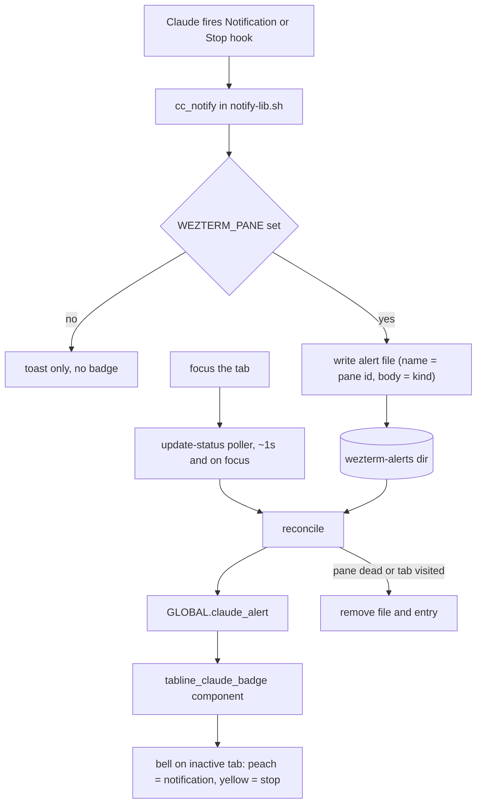

# WezTerm Claude Tab Badge — File-Channel Signal (Reliability Redesign)

**Date:** 2026-06-25
**Status:** Approved (design) — supersedes the signal-delivery half of
`2026-06-25-wezterm-claude-notification-tab-badge-design.md`.
**Platform:** Windows only (the change lives entirely inside the `is_windows`
branches; macOS/Linux tmux behaviour is untouched).

## Problem

The shipped non-switching tab badge has two independent runtime failures,
confirmed in the live GUI:

1. **A dim bell shows on every tab with output (clutter).** The component's
   fallback tier (`.config/wezterm/tabline_claude_badge.lua:51-57`) renders a
   bell whenever `pane.has_unseen_output` is true. That flag is *not*
   Claude-aware — any pane that prints (a build, a log tail, `nvim`) trips it.
   It cannot answer "which **Claude** tab needs me," so it is pure noise.

2. **The precise peach/yellow badge never fires.** The intended signal path is
   `claude/hooks/lib/notify-lib.sh:79-81` → `printf '\033]1337;SetUserVar=...'
   > /dev/tty` → WezTerm's `user-var-changed` handler
   (`.config/wezterm/wezterm.lua:349-357`). The WezTerm side is correct and
   registered; the OSC simply never arrives. On Windows the sequence must
   traverse **ConPTY through Claude Code's fullscreen TUI** to reach WezTerm,
   and that link does not hold (ConPTY is a known filter of non-standard OSC
   such as iTerm2's 1337). `wezterm cli` on the installed nightly
   (`20260607-082427`) has **no `set-user-var`** subcommand, so there is no
   CLI escape hatch either.

### Root cause

The design routes the signal *through the terminal* (tty/OSC), the one path
that is unreliable on Windows — while the reliable identifier we need is
already sitting in the environment. WezTerm exports `WEZTERM_PANE` into every
pane; it inherits down the spawn chain to the hook (verified: a tool process
spawned by Claude Code in a WezTerm pane sees `WEZTERM_PANE=10`). The hook
therefore already knows *which WezTerm pane it is in* — no round-trip needed.

## Goals

- A tab shows a bell **only** when a Claude in that tab needs attention:
  `notification` (waiting on a permission/input prompt) or `stop` (finished its
  turn). Nothing else ever badges a tab.
- The signal path does not depend on tty, ConPTY, or OSC passthrough.
- The badge does not switch or focus tabs (preserve the fix already shipped in
  `claude-notify.ps1`).
- The reconcile logic is unit-testable off-GUI (the previous design's failure
  was that its only verification was manual GUI inspection).

## Non-goals

- macOS/Linux behaviour (tmux `monitor-bell` path) — unchanged.
- Sub-WezTerm-pane granularity. The WezTerm tab bar can only flag a WezTerm
  pane/tab; if several Claudes are stacked inside one WezTerm pane (e.g. Zellij
  splits), the badge coarsens to "this WezTerm tab has a Claude waiting." See
  Assumptions.
- Flashing/animated badges (the unused `FLASH` path is removed, YAGNI).

## The contract (the entire interface between hook and WezTerm)

```
${XDG_CACHE_HOME:-$HOME/.cache}/claude-notify/wezterm-alerts/<pane_id>
```

- **Directory** reuses the `claude-notify` cache namespace `notify-lib.sh:34`
  already established.
- **Filename** is the WezTerm pane id (`$WEZTERM_PANE`), e.g. `10`.
- **File body** is the alert kind: the literal string `notification` or `stop`
  (no trailing newline; written with `printf '%s'`).
- **Presence** of the file = "this pane is waiting." **Absence** = cleared.

Both sides derive the directory from the home dir so they resolve to the same
physical path: the hook via `$HOME/.cache` (MSYS `$HOME` = `C:\Users\<user>`),
WezTerm via `wezterm.home_dir .. '/.cache'`, each honouring `XDG_CACHE_HOME`
if set.

## Architecture

One producer, one reconciler (the **sole** writer of `GLOBAL.claude_alert`),
one renderer:



### Lifecycle

1. Claude fires the Notification/Stop hook → `cc_notify` writes
   `…/wezterm-alerts/10` = `notification`.
2. Within ~1s, the `update-status` poller reads the directory →
   `GLOBAL.claude_alert = {["10"] = "notification"}`.
3. The tabline renders a peach `md_bell_ring` on the tab containing pane 10 —
   **no switch**.
4. You focus that tab → `update-status` fires on focus → pane 10 is in the
   active tab (visited) → file + entry removed → badge clears.
5. Claude's pane closes → pane 10 is no longer live → its file is pruned on the
   next tick (no orphan badges).

## Component specifications

### 1. NEW `.config/wezterm/wezterm_claude_alerts.lua`

Pure reconcile logic, extracted from `wezterm.lua` so it can be unit-tested
without loading the full (side-effectful) WezTerm config. No `require` of
`wezterm` — all I/O is injected.

```lua
local M = {}

-- Shared directory contract with notify-lib.sh.
function M.dir(home, xdg_cache)
  return (xdg_cache or (home .. '/.cache')) .. '/claude-notify/wezterm-alerts'
end

-- paths:    array of absolute file paths (from wezterm.read_dir)
-- live:     set of currently-live pane-id strings  -> true
-- visited:  set of pane-id strings in the active tab -> true
-- read_file(path) -> string|nil   remove(path) -> ()
-- Returns the alerts table; removes stale (dead pane) and visited files.
function M.reconcile(paths, live, visited, read_file, remove)
  local alerts = {}
  for _, path in ipairs(paths) do
    local id = path:match('([^/\\]+)$')
    if id then
      if not live[id] or visited[id] then
        remove(path)
      else
        local kind = read_file(path)
        if kind then kind = kind:gsub('%s+$', '') end
        if kind and kind ~= '' then alerts[id] = kind end
      end
    end
  end
  return alerts
end

return M
```

### 2. `claude/hooks/lib/notify-lib.sh` — Windows branch

Replace the OSC emit (`:79-81`, the `SetUserVar` line) with a pane-keyed file
write. The desktop-toast block below it is unchanged.

```bash
MINGW*|MSYS*|CYGWIN*|Windows_NT)
  # Tab-badge cue: record which WezTerm pane is waiting, keyed by $WEZTERM_PANE,
  # so the tab bar can flag it without switching (see tabline_claude_badge.lua +
  # the update-status poller in wezterm.lua). File channel — robust on Windows,
  # where OSC-through-ConPTY to WezTerm does not arrive. CC_ALERT_DIR is a test seam.
  if [ -n "${WEZTERM_PANE:-}" ]; then
    local alert_dir="${CC_ALERT_DIR:-${XDG_CACHE_HOME:-$HOME/.cache}/claude-notify/wezterm-alerts}"
    mkdir -p "$alert_dir" 2>/dev/null \
      && printf '%s' "$kind" > "$alert_dir/$WEZTERM_PANE" 2>/dev/null || true
  fi
  # Desktop toast via the repo-vendored notifier (unchanged) ...
  ;;
```

Removed: the `SetUserVar` OSC write and the `CC_TTY` seam (no longer used).

### 3. `.config/wezterm/wezterm.lua`

- **Require the module** inside the `is_windows` block (it is only used there):
  `local claude_alerts = require('wezterm_claude_alerts')`.
- **Extend the existing `update-status` handler** (`:333`), after the
  workspace-tracking block, with the reconcile pass:

```lua
-- Claude tab badge: reconcile the pane-keyed alert dir into GLOBAL.claude_alert.
-- Sole writer of that table. Prunes dead panes and clears the visited tab.
local dir = claude_alerts.dir(wezterm.home_dir, os.getenv('XDG_CACHE_HOME'))
local paths = {}
pcall(function() paths = wezterm.read_dir(dir) end)   -- missing dir -> {}

local live = {}
for _, w in ipairs(wezterm.mux.all_windows()) do
  for _, t in ipairs(w:tabs()) do
    for _, p in ipairs(t:panes()) do
      live[tostring(p:pane_id())] = true
    end
  end
end

local visited = {}
local at = window:active_tab()
if at then
  for _, p in ipairs(at:panes()) do
    visited[tostring(p:pane_id())] = true
  end
end

local function read_file(path)
  local fh = io.open(path, 'r'); if not fh then return nil end
  local s = fh:read('*a'); fh:close(); return s
end
---@diagnostic disable-next-line: inject-field
wezterm.GLOBAL.claude_alert = claude_alerts.reconcile(paths, live, visited, read_file, os.remove)
```

- **Remove the `user-var-changed` handler** (`:349-357`). No OSC arrives on
  Windows, and a second writer to `GLOBAL.claude_alert` would be clobbered by
  the poller's whole-table reassignment each tick.
- The `package.loaded['tabline.components.tab.claude']` registration (`:467`)
  and the `"claude"` entry in `tab_inactive` (`:541`) are unchanged.

### 4. `.config/wezterm/tabline_claude_badge.lua`

Becomes a pure reader of `GLOBAL.claude_alert`; the poller now owns all
clearing. Delete the fallback tier (`:51-57`), the `overlay0` token, and the
`FLASH` block.

```lua
local wezterm = require('wezterm')

local frappe = {
  crust  = '#232634',
  peach  = '#ef9f76',
  yellow = '#e5c890',
}

return {
  default_opts = {},
  update = function(tab, opts)
    if tab.is_active then return end          -- never badge the tab you're on
    local alerts = wezterm.GLOBAL.claude_alert or {}
    local kind
    for _, p in ipairs(tab.panes) do
      kind = kind or alerts[tostring(p.pane_id)]
    end
    if kind == 'notification' then
      opts.icon = { wezterm.nerdfonts.md_bell_ring, color = { fg = frappe.crust, bg = frappe.peach } }
      return ' '
    elseif kind == 'stop' then
      opts.icon = { wezterm.nerdfonts.md_bell, color = { fg = frappe.crust, bg = frappe.yellow } }
      return ' '
    end
  end,
}
```

## Edge cases & error handling

- **Not running in WezTerm** (`$WEZTERM_PANE` unset — e.g. VS Code integrated
  terminal): the hook writes no file; the desktop toast still fires. Graceful
  no-op, no badge.
- **Filesystem failure** in the hook: `mkdir`/`printf` are `|| true` and
  redirect errors to `/dev/null` — a full disk or permission error never
  breaks the notification or the hook chain.
- **Concurrent Claudes**: one file per pane id, so hooks never race on a shared
  file. The most recent write per pane wins (a tab that goes `stop` →
  `notification` ends up `notification`, the more urgent state).
- **Stale files** (Claude exited, or pane/tab closed without a visit): the pane
  id drops out of `live`, so the poller removes the file on the next tick. A
  stale entry never displays in the meantime either, because the component only
  matches pane ids present in a rendered tab.
- **Poll robustness**: `read_dir` is wrapped in `pcall` (missing dir → empty
  list → `GLOBAL.claude_alert = {}`, which clears everything); `io.open` is
  nil-guarded; `os.remove` failures are ignored.
- **Alert while the tab is active**: the `tab.is_active` early-return in the
  component suppresses the badge, and the poller clears the file on the same
  focus tick — so watching a tab never shows its own bell.

## Testing strategy

All three units are tested off-GUI. New `.sh` wrappers are auto-discovered by
`claude/hooks/tests/run-tests.sh` (it runs every `test-*.sh`).

- **Producer** — rewrite `claude/hooks/tests/test-notify-windows.sh`:
  stub `uname` → `MINGW`, stub `powershell.exe`; set `CC_ALERT_DIR=<tmp>` and
  `WEZTERM_PANE=42`; call `cc_notify "t" "b" "notification"` and assert
  `<tmp>/42` contains exactly `notification`; repeat with kind `stop`; assert
  **no** file is written when `WEZTERM_PANE` is unset; assert the toast notifier
  (`powershell.exe` stub) is still invoked; static-assert the lib no longer
  writes the `SetUserVar` OSC / to `/dev/tty`.
- **Reconciler** — NEW `claude/hooks/tests/test-claude-alerts.lua` +
  `test-claude-alerts.sh` (mirrors the badge wrapper; points `lua` at
  `.config/wezterm/wezterm_claude_alerts.lua`, skips if `lua` absent). Cases:
  `dir()` returns the contract path for given home / `XDG_CACHE_HOME`;
  `reconcile` with paths `{…/10, …/11, …/99}`, `live = {10,11}`,
  `visited = {11}`, file bodies `10→notification`, `11→stop` →
  returns `{["10"]="notification"}`, and `remove` was called for `…/11`
  (visited) and `…/99` (dead); trailing-whitespace body is trimmed; empty body
  yields no entry.
- **Renderer** — update `claude/hooks/tests/test-tabline-claude-badge.lua`:
  keep the `notification` → peach `md_bell_ring`, `stop` → yellow `md_bell`,
  active-tab → no badge, and no-entry → no badge cases; **delete** the
  `has_unseen_output` fallback case (the tier is gone).

## Assumptions

- **One Claude per WezTerm tab/pane.** Pane id is then an exact key and the
  badge points at the right tab. If Claudes are stacked inside one WezTerm pane
  via Zellij/tmux, the badge coarsens to the WezTerm tab and a visit clears all
  of that pane's alerts at once — acceptable, and the finest the WezTerm tab bar
  can express.
- `$HOME` (MSYS, in the hook) and `wezterm.home_dir` resolve to the same user
  profile directory, so both sides compute the same alert dir. The plan
  verifies this once during implementation.
- `wezterm.read_dir` returns absolute paths (per WezTerm docs); the basename
  match and `read_file` rely on this. The plan confirms it on the installed
  build.

## Deployment

No deploy-script change. `.config/wezterm/` is a directory symlink, so the new
`wezterm_claude_alerts.lua` is live for WezTerm immediately; `claude/hooks/…`
rides the `claude/ → ~/.claude` symlink. Activation is a WezTerm config reload
(`Ctrl+Shift+R`); the hooks are picked up on their next invocation.
