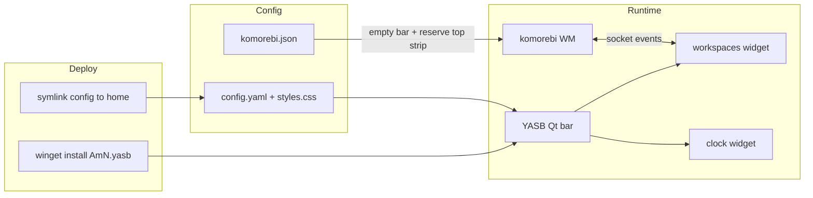

# YASB status bar — minimal komorebi-bar replacement design

- **Date:** 2026-06-25
- **Status:** Approved design (brainstorming) → pending implementation plan
- **Scope:** Windows only. Replaces the built-in `komorebi-bar` with [YASB](https://github.com/amnweb/yasb) (Yet Another Status Bar), starting **minimal**: a komorebi-workspaces widget and a clock — nothing else. Companion to the [Komorebi Hyper-key keybinds design](./2026-06-25-komorebi-hyper-keybinds-design.md).

## Problem / motivation

The Windows desktop currently uses komorebi's built-in bar, auto-spawned by komorebi from `bar_configurations` in `komorebi.json:26-29` (two `komorebi-bar` instances, one per monitor). The user wants to switch to **YASB** instead. Rationale (from the vault note `03.Resources/Computer/Window/Yasb to replace komorebi bar.md`): **YASB renders with Qt, whereas komorebi-bar uses egui immediate-mode** — YASB is more configurable (CSS styling, richer widget set) and is the target for a future, more featureful bar.

This first cut is deliberately **minimal** to prove the integration end-to-end before investing in widgets: only **active workspaces + a clock**. There is no prior YASB config anywhere in the repo or vault — this is greenfield.

## Decision

Replace komorebi-bar with a YASB bar managed by the dotfiles (config symlinked, package installed via the deploy script), themed to match the rest of the environment (Catppuccin Frappe + JetBrainsMono Nerd Font). komorebi stops drawing its own bar and instead **reserves the top strip** of each monitor's work area so tiled windows clear the YASB bar.

**Cutover stance (user-chosen): replace now, keep the old configs for rollback.** Empty komorebi's `bar_configurations` and retain the three `komorebi.bar*.json` files in-repo (inert) so reverting is a two-line change.

**Polish level (user-chosen): matched + deploy-wired.** Frappe CSS + Nerd Font from the start; `AmN.yasb` added to the winget list; `.config/yasb` symlinked by `deploy_windows.ps1`. Autostart stays **manual** (one-time `yasbc enable-autostart`), matching how komorebi itself is launched today.

## Architecture & data flow

YASB is a standalone Qt process, independent of komorebi. It reads `~/.config/yasb/{config.yaml,styles.css}` (a symlink into the dotfiles), connects to komorebi over komorebi's socket to drive the **workspaces** widget (event-driven — no polling), and renders a **clock** from local time. komorebi no longer draws a bar; `komorebi.json` is changed to reserve the work-area strip YASB occupies.



## The replacement mechanic (the crux)

komorebi-bar, when active, automatically reserves work area for itself (the `work_area_offset` lives **inside** the bar config files — `komorebi.bar.monitor1.json:5-10` reserves top/bottom 50px). Once `bar_configurations` is emptied, **that reservation goes inert**, and YASB — a separate always-on-top window — would overlap tiled windows.

The fix is to reserve the strip from komorebi's side, the documented path for an **external** bar:

- Set **`global_work_area_offset`** in `komorebi.json` (a `Rect`), reserving the bar height at the top:
  ```json
  "global_work_area_offset": { "left": 0, "top": 40, "right": 0, "bottom": 0 }
  ```
  (Equivalent CLI: `komorebic global-work-area-offset 0 40 0 0`.)

**Pitfall — do not double-reserve.** If YASB turns out to register as a Windows AppBar (self-reserving), komorebi's offset would stack on top of YASB's, producing a doubled gap. The primary plan assumes YASB does **not** self-reserve (typical for a frameless Qt bar; the komorebi community standard for external bars is `global_work_area_offset`). This is confirmed by eye during implementation: if a doubled gap appears, drop the komorebi offset; if windows tile under the bar, the offset is required (expected case). The exact `top` px is tuned to the rendered bar height (start at 40 for a 36px bar).

`global_work_area_offset` applies to **all** monitors uniformly, which suits a single bar definition shown on every monitor.

Note: the old komorebi-bar config also reserved a symmetric **50px bottom** gap (`komorebi.bar.monitor1.json:5-10`) — a purely cosmetic "floating" inset. This design reserves the **top only** (where the bar is); windows will now extend to the bottom screen edge. Restore the inset by setting `bottom` in the offset if the floating look is preferred.

## Files

### New — `dotfiles/.config/yasb/`

| File | Purpose |
|---|---|
| `config.yaml` | The bar + widget definitions (below). |
| `styles.css` | Catppuccin Frappe theme + JetBrainsMono Nerd Font. |
| `README.md` | One-screen note: replaces komorebi-bar, `yasbc enable-autostart`, how to roll back. |

**`config.yaml` shape** (verified widget types/options against the [YASB Configuration](https://github.com/amnweb/yasb/wiki/Configuration), [Komorebi Workspaces](https://github.com/amnweb/yasb/wiki/(Widget)-Komorebi-Workspaces), and [Clock](https://github.com/amnweb/yasb/wiki/(Widget)-Clock) wiki pages):

- Root options: `watch_config: true`, `watch_stylesheet: true`, `debug: false`.
- `komorebi:` tray block uses **plain `komorebic start` / `komorebic stop` / `komorebic reload-configuration`** — **not** the wiki default `--whkd` form, because this setup drives komorebi hotkeys via **AutoHotkey** (`komorebi.ahk`), not whkd.
- One bar, `yasb-bar`: `enabled: true`, `screens: ['*']` (all monitors), layout `widgets: { left: ["workspaces"], center: ["clock"], right: [] }`.
- Widget `workspaces`: `type: "komorebi.workspaces.WorkspaceWidget"`, `hide_empty_workspaces: true` (matches the current bar's `komorebi.bar.monitor1.json:23` and the user's preferred "occupied + focused only" strip), `label_workspace_btn: "{name}"` / `label_workspace_active_btn: "{name}"` to mirror komorebi's Roman-numeral workspace names (I–X, defined in `komorebi.json:39-169`).
- Widget `clock`: `type: "yasb.clock.ClockWidget"`, `label: "{%H:%M}"` (24-hour, matching the current bar's `Time: TwentyFourHour`), `label_alt` with the full date, a Nerd Font clock glyph (not an emoji — see Theming).

### Modified

| File | Change |
|---|---|
| `.config/komorebi/komorebi.json` | `bar_configurations` → `[]` (stop spawning komorebi-bar); add `global_work_area_offset` reserving the top strip. Nothing else changes. |
| `deploy_windows.ps1` | Add `@{ Id = "AmN.yasb"; Name = "YASB" }` to the winget package list (beside komorebi at `:56`); add a `$symlinks` entry `.config\yasb` → `$HOME\.config\yasb` (whole-dir, like komorebi at `:73-74`); add `yasbc enable-autostart` to the post-install "Next steps" text (near `:748`). |
| `CLAUDE.md` / `AGENTS.md` | Add YASB to the Windows symlink-mappings table and the key-config-files table; note in the Window-Management section that the Windows bar is now YASB, not komorebi-bar. |

### Retained for rollback (left in-repo, unused)

`komorebi.bar.json`, `komorebi.bar.monitor1.json`, `komorebi.bar.monitor2.json`. Rollback = restore `bar_configurations` to reference the two monitor files and delete `global_work_area_offset`.

## Theming

Minimal **Catppuccin Frappe** `styles.css` for parity with WezTerm / Zellij / tmux / komorebi (all Frappe across the setup):

- Bar background Frappe base `#303446`; default text `#c6d0f5`.
- Active workspace accent **Frappe blue `#8caaee`**, mirroring komorebi's `theme.bar_accent: Base0D` (`komorebi.json:19`).
- `font-family: 'JetBrainsMono Nerd Font'` — the terminal/bar standard (matches the WezTerm font chain).
- Icons (e.g. the clock glyph) use **Nerd Font codepoints, not emoji**. The WezTerm emoji-shadowing gotcha (Nerd-Font-primary shadows color-emoji → monochrome) applies to CSS `font-family` too; using glyphs avoids it.

CSS is intentionally small for v1 — enough for legible, on-theme workspaces + clock, not a full design system.

## Autostart

**Manual, one-time:** `yasbc enable-autostart` (registry `Run` key). Rationale: it matches how komorebi itself is started (manually / via profile — no Task Scheduler convention exists in this setup yet), and is trivially upgradable to `yasbc enable-autostart --task` (Task Scheduler, supports a startup delay) later. Documented in the deploy "Next steps" and `.config/yasb/README.md`.

**Start-order is not critical:** YASB shows "Komorebi Offline" until komorebi's socket is up, then connects — so it tolerates launching before komorebi.

## Deploy integration

- **Package:** `winget install AmN.yasb` via the existing package loop (user-scope, consistent with komorebi).
- **Symlink:** whole-directory `.config\yasb` → `$HOME\.config\yasb`, created with `New-Item -ItemType SymbolicLink` (`deploy_windows.ps1:405`) — never git-bash `ln -s`, which silently copies directories on Windows. YASB reads `~/.config/yasb/` by default, so no `YASB_CONFIG_HOME` is needed.
- **Liveness:** the symlink targets the working tree, so this change must land on **`master`** to remain live after branch switches (a feature-branch-only config disappears on checkout).

## Risks / edge-cases

| Risk | Handling |
|---|---|
| Doubled work-area gap (YASB self-reserves *and* komorebi offset) | Primary plan assumes YASB does not self-reserve; confirm by eye, drop one side if doubled. |
| Exact top-offset px unknown until rendered | Start at `top: 40` (bar height 36 + breathing room); tune empirically. |
| Third monitor gains a bar it didn't have | Intended — `screens: ['*']` puts a consistent bar on all monitors (komorebi previously bar-configured only two). Scope `screens` to specific monitor names if undesired. |
| komorebi resize-storm (hypothesized Zellij-hang contributor) | YASB's workspaces widget is socket/event-driven, not polling → should not compound it. Low risk. |
| `{name}` may not resolve to komorebi's Roman numerals | Fall back to `label_workspace_btn: "{index}"` (numeric 1–10) if names render blank. |

## Testing / validation

1. `./deploy_windows.ps1 -DryRun` — preview the new symlink + winget package without executing.
2. `Get-Command -Syntax .\deploy_windows.ps1` — PowerShell syntax check after edits.
3. Deploy (admin) → `yasbc monitor-information` lists monitors → launch YASB.
4. Observe: a bar on **every** monitor; workspaces widget populates and updates as workspaces are switched (Hyper+digit, per the keybinds design); empty workspaces hidden; clock ticks in 24h; **no window overlaps the bar** and **no doubled gap**.
5. Rollback test: restore `bar_configurations`, delete `global_work_area_offset`, restart komorebi → komorebi-bar returns.

## Out of scope (YAGNI for v1)

Active-window / title widget, media/CPU/memory/network/battery/update widgets, system tray, multiple bars, per-monitor differentiated layouts, Task Scheduler autostart, click handlers, and any non-Frappe theming. These are deferred; the current komorebi bar's extra widgets (`komorebi.bar.monitor1.json`) are **not** ported.

## Open items to confirm during implementation

- Exact `global_work_area_offset.top` px (rendered bar height).
- Whether YASB self-registers as a Windows AppBar (decides if the komorebi offset stays).
- Whether `{name}` shows komorebi's Roman numerals or needs `{index}`.

## References

- YASB: [repo](https://github.com/amnweb/yasb) · [Configuration](https://github.com/amnweb/yasb/wiki/Configuration) · [Installation](https://github.com/amnweb/yasb/wiki/Installation) · [Komorebi Workspaces widget](https://github.com/amnweb/yasb/wiki/(Widget)-Komorebi-Workspaces) · [Clock widget](https://github.com/amnweb/yasb/wiki/(Widget)-Clock)
- komorebi work-area offset: [`global-work-area-offset` CLI](https://lgug2z.github.io/komorebi/cli/global-work-area-offset.html) · [bar-config / offset behaviour (DeepWiki)](https://deepwiki.com/LGUG2Z/komorebi/5.3-bar-configuration-(komorebi.bar.json))
- Current state: `.config/komorebi/komorebi.json` (`:19` accent, `:26-29` bar_configurations, `:39-169` workspace names), `.config/komorebi/komorebi.bar.monitor1.json` (`:5-10` work_area_offset, `:23` hide_empty, `:38-45` clock), `deploy_windows.ps1` (`:56` winget, `:73-74` symlink, `:405` New-Item, `:748` next-steps)
- Vault: `03.Resources/Computer/Window/Yasb to replace komorebi bar.md` (intent + Qt-vs-egui), `05.Wiki/concepts/Dynamic Workspaces on yabai.md` (occupied+focused strip preference)
